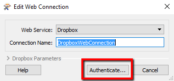
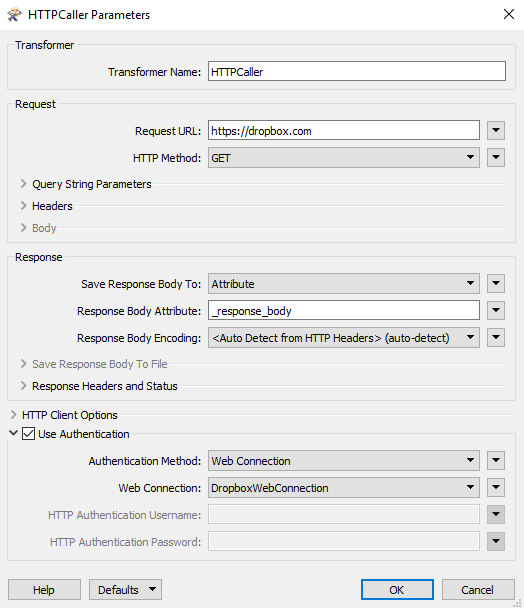

<!--Exercise Section-->

<table style="border-spacing: 0px;border-collapse: collapse;font-family:serif">
<tr>
<td width=25% style="vertical-align:middle;background-color:darkorange;border: 2px solid darkorange">
<i class="fa fa-cogs fa-lg fa-pull-left fa-fw" style="color:white;padding-right: 12px;vertical-align:text-top"></i>
Exercise 1
</td>
<td style="border: 2px solid darkorange;background-color:darkorange;color:white">
Adding a Web Connection
</td>
</tr>

<tr>
<td style="border: 1px solid darkorange; font-weight: bold">Data</td>
<td style="border: 1px solid darkorange">N/A</td>
</tr>

<tr>
<td style="border: 1px solid darkorange; font-weight: bold">Overall Goal</td>
<td style="border: 1px solid darkorange">Authenticate a web conection for FME Server</td>
</tr>

<tr>
<td style="border: 1px solid darkorange; font-weight: bold">Demonstrates</td>
<td style="border: 1px solid darkorange">How to authenticate a web connection for Dropbox</td>
</tr>

<tr>
<td style="border: 1px solid darkorange; font-weight: bold">Start Workspace</td>
<td style="border: 1px solid darkorange">None</td>
</tr>

<tr>
<td style="border: 1px solid darkorange; font-weight: bold">End Workspace</td>
<td style="border: 1px solid darkorange"></td>
</tr>

</table>

---

blah blah want make web connection blah blah fme server is the answer blah

**1) Create a workspace**

The first step in adding a web connection is to create a workspace to run. Open FME Workbench and create a new Blank Workspace.

Add a **Creator** transformer, and an **HTTPCaller** transformer. Right-click **HTTPCaller* and select *Connect Loggers*.

Click the red cog on the **HTTPCaller** transformer to open the parameters.

Fill in the *HTTPCaller parameters* dialog box as follows:

- **Request URL:** https://dropbox.com
- **HTTP Method:** GET
- Check the box **Use Authentication**.
- Click the drop down arrow for **Authentication Method** and select *Web Connection*.
- Click the drop down arrow for **Web Connection** and select *Add Web Connection...*

Fill in the *Edit Web Connection* dialog box as follows:

- **Web Service:** Dropbox
- **Connection Name:** DropboxWebConnection

Click *Authenticate...*

The *Web Service Authentication* dialog box opens.

Enter the following:

- Email: fmeserver2017@gmail.com
- Password: fme_server

and then click **Sign in**

Click **Allow** to allow FME to access Dropbox.

Your *HTTPCaller Parameters* dialog box should now look like the following:

Click **OK** to close the dialog box.

Click the Run button to make sure you have properly configured the **HTTPCaller**.

Translation was successful and we are now ready to publish the workspace to FME Server.

**2) Publish to FME Server**

Publish the workspace to FME Server from the file menu in FME Workbench:

When prompted, publish the workspace to:

- **Repository Name:** testing
- **Workspace Name:** DropboxWebConnection

At *Upload Connections*, make sure there is a check mark beside your connection and click **Add Service...**.

The *Add Dropbox Service to FME Server* dialog box opens.

Fill out the parameters as follows:

- **Client Id:** efsdwkfh71l7da1
- **Client Secret:** e4ycoikcun58uoz
- **Redirect Uri:** https://dropbox.xom

Click **OK**.

Click **Next**

Make sure **Job Submitter** has a check mark beside it. Click **Publish**.

**3) Login to FME Server**

**4) Authorize Web Connection**

Go to **Connections &gt; Web Connections**

Click **DropboxWebConnection** in your list of Web Connections.

On the *Edit* page, click the **Authorize** button:

If a window opens with the login screen for Dropbox, then you have successfully added a web connection to FME Server!

---

<!--Exercise Congratulations Section--> 

<table style="border-spacing: 0px">
<tr>
<td style="vertical-align:middle;background-color:darkorange;border: 2px solid darkorange">
<i class="fa fa-thumbs-o-up fa-lg fa-pull-left fa-fw" style="color:white;padding-right: 12px;vertical-align:text-top"></i>
CONGRATULATIONS!
</td>
</tr>

<tr>
<td style="border: 1px solid darkorange">

By completing this exercise you have learned how to:
 
<ul><li>Establish a web service</li>
<li>Publish a web connection to FME Server</li>
<li>Authorize a web connection on FME Server</li>
</ul>

</td>
</tr>
</table>

---