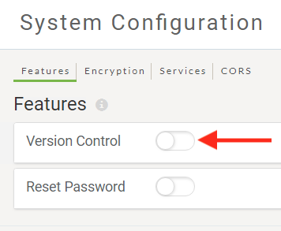
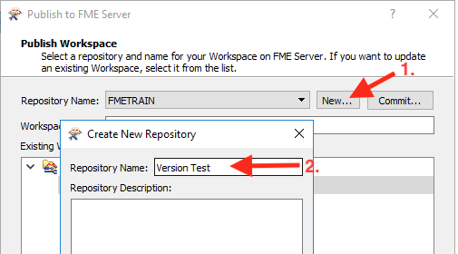
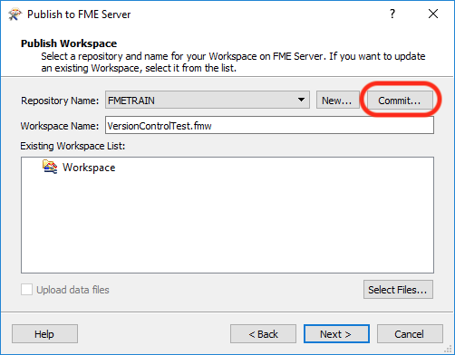
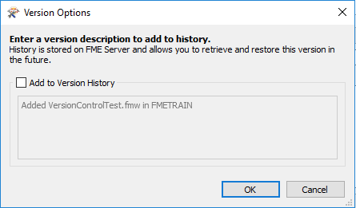
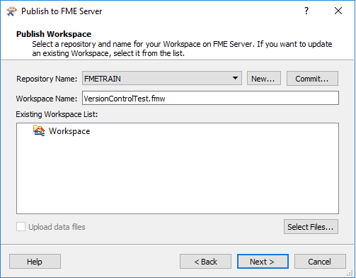
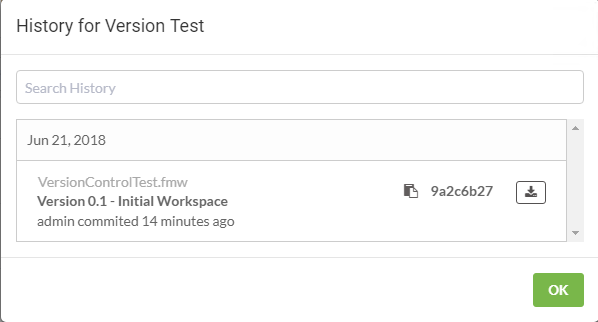

<!--Exercise Section-->

<table style="border-spacing: 0px;border-collapse: collapse;font-family:serif">
<tr>
<td width=25% style="vertical-align:middle;background-color:darkorange;border: 2px solid darkorange">
<i class="fa fa-cogs fa-lg fa-pull-left fa-fw" style="color:white;padding-right: 12px;vertical-align:text-top"></i>
Exercise 7
</td>
<td style="border: 2px solid darkorange;background-color:darkorange;color:white">
Versioning a Workspace
</td>
</tr>

<tr>
<td style="border: 1px solid darkorange; font-weight: bold">Overall Goal</td>
<td style="border: 1px solid darkorange">Version a Workspace</td>
</tr>

<tr>
<td style="border: 1px solid darkorange; font-weight: bold">Demonstrates</td>
<td style="border: 1px solid darkorange">How to version a workspace that has been published to FME Server.</td>
</tr>

<tr>
<td style="border: 1px solid darkorange; font-weight: bold">Start Workspace</td>
<td style="border: 1px solid darkorange">C:\FMEData2019\Workspaces\ServerAdmin\Customization-Ex3-Versioning-Begin.fmw</td>
</tr>

<tr>
<td style="border: 1px solid darkorange; font-weight: bold">End Workspace</td>
<td style="border: 1px solid darkorange">C:\FMEData2019\Workspaces\ServerAdmin\Customization-Ex3-Versioning-Complete.fmw</td>
</tr>

</table>

---

Your GIS department has two staff members that regularly author and make changes to their own workspaces and others when necessary.  On a few occasions, changes were made to workspaces that caused a workspace to fail after the edit was made. The original working workspace was not backed up and was lost. This resulted in extra time to uncover the cause and restore the previous working workspace.

Your Management has learned about the new Version Control feature in FME Server and wonder if it might reduce these issues from occurring.  Your task is to enable Version Control and ensure it is functioning correctly.

---

<!--Miss Vector says...-->

<table style="border-spacing: 0px">
<tr>
<td style="vertical-align:middle;background-color:darkorange;border: 2px solid darkorange">
<i class="fa fa-quote-left fa-lg fa-pull-left fa-fw" style="color:white;padding-right: 12px;vertical-align:text-top"></i>
Miss Vector says...
</td>
</tr>

<tr>
<td style="border: 1px solid darkorange">

If you have completed the Configure for HTTPS exercise, remember that the URL to connect to FME Server is now https://localhost:8443/fmeserver and NOT http://localhost/fmeserver!

</td>
</tr>
</table>

 **1) Login to FME Server**
 Open the FME Server web interface, either through the Web Interface option on the Windows Start Menu or directly in your web browser, and log in using the username and password *admin*.

 **2) Enable Version Control**
You can enable Version Control in FME Server via the System Configurations page.  Select Features, and then click the toggle next to the Version Control.

The toggle will turn green indicating enabled.  We do not need to update the *Remote Settings* for basic local Version Control functionality.  

 **3) Create a Workspace**
 Next, you must create a simple workspace that you can use to test the Version Control feature with.

Open FME Workbench and create a new Blank Workspace.

Add a **Creator** transformer to the workspace.

Save the workspace.

**4) Run the Workspace**
 It is a best practice to first run the workspace in FME Desktop before uploading it to FME Server. If the workspace does not run in FME Desktop, then it will not run in FME Server!

Click **Run** to make sure the translation is successful. Now we are ready to publish the workspace to FME Server.

 **5) Publish to FME Server**
 Select *Publish to FME Server* under the File Menu. Use the Publish to FME Server Wizard to place the workspace in a new repository called **Version Test**. Create the new Repository by clicking on **New...** button if it does not exist.

Click OK, to create the new repository and return the  Publish to FME Server dialog.

Next, you should see a new button on the  Publish to FME Server dialog called **Commit...**.

Click the **Commit** button, and the following dialog will appear:

Click the checkbox and populate the Textbox with **Version 0.1 Initial Workspace** and click **OK**.

Click **OK** to dismiss the Version Options dialog and return to the Publish to FME Server dialog.

Click **Next**
Make sure that the workspace is registered with the **Job Submitter** FME Server Service.
Click **Publish**.

 **6) Review Version History in Web UI**

 Open the FME Server web interface, either through the Web Interface option on the Windows Start Menu or directly in your web browser, and log in using the username and password *admin*.

Click on the **Repositories** in the left menu.  This will list all Repositories.  Next click the checkbox next to the repository **Version Test** that you created in step 5 and then click the **History** button.

The following dialog should be displayed showing the recent Version Control entries for this Repository.

.

Click **OK** to dismiss the dialog.

 **6) Downloading a versioned workspace**

When it is necessary to download a versioned workspace, and you want to retrieve a particular version you must do this from the Web UI.  FME Workbench cannot select a versioned workspace through the Download Wizard.  Download the Version 0.1 of the Workspace we just published.

Log back into FME Server as *admin* and in the FME Server Web UI, click on the **Repositories** in the left menu.  This will list all Repositories.  Next click on the **Version Test** repository.  This will display the workspaces inside this repository. You should only see the one workspace called *VersionControlTest.fmw*.

Let's review the Version History again.  Click the checkbox next to the workspace and then click the **History** button.

This will return the following dialog window list the available versions.  

Let's download this workspace and open it in FME Desktop. In the dialog below click on the *Download* icon next to the workspace, you wish to download.  In this example that is *VersionControlTest.fmw & Version 0.1 - Initial Workspace*.  Remember where you saved the workspace if you selected another location then the default one.  

 **7) Edit workspace and republish same workspace**

Next, we want to make a small edit to the workspace and republish it to FME Server. We will then visit the Web UI and Version the workspace thereafter having successfully tested that it works.

Open the workspace that we downloaded in step 6. The default download location is **C:\Users\Administrator\Downloads** and the workspace should called *VersionControlTest.fmw*

With the workspace open in FME Workbench, add a *Logger* to the *Creator* transformer.

Save the workspace and Run the workspace.  Next, let's publish it to FME Server.

This time, **DO NOT** use the commit button on the publish wizard. You will get a warning that the workspace already exists in the repository, this is ok since we have version control enabled. Click Yes to *update* the workspace. We will commit the workspace using the Web UI in the next step.

**8) Version the Workspace using FME Server Web UI**

We've published the workspace and our colleague has confirmed the workspace runs.  Now we will create a new version for the workspace using the Web UI.

Log into FME Server Web UI with the *admin* user.  

Review the Version History again for the workspace.  Click on *Repositories* in the left menu and navigate to the **Version Test** repository, and finally, click on the repository name to view the contents.  

There should be one workspace called **VersionControlTest.fmw**.  

Next, select the workspace and click the Commit button.

This will open the *Commit Item* dialog.  Enter a commit comment and click the **Commit** button.

You should receive the following success confirmation that the Version was created.  

<!--TIP-->
(NOTE: if you get an error it is likely that the workspace had no changes made to it. Republish the workspace from FME Workbench and ensure an edit was made and saved in the workspace. )

Review the Version History for the workspace and this time you should see the new Version listed.

You have successfully enabled and tested Version Control for FME Server.

---

<!--Tip Section-->

<table style="border-spacing: 0px">
<tr>
<td style="vertical-align:middle;background-color:darkorange;border: 2px solid darkorange">
<i class="fa fa-info-circle fa-lg fa-pull-left fa-fw" style="color:white;padding-right: 12px;vertical-align:text-top"></i>
TIP
</td>
</tr>

<tr>
<td style="border: 1px solid darkorange">

If there have been no changes to the workspace since the last commit you will be notified.
  
  This confirms a version of the workspace already exists.

</td>
</tr>
</table>

---

<!--Exercise Congratulations Section-->

<table style="border-spacing: 0px">
<tr>
<td style="vertical-align:middle;background-color:darkorange;border: 2px solid darkorange">
<i class="fa fa-thumbs-o-up fa-lg fa-pull-left fa-fw" style="color:white;padding-right: 12px;vertical-align:text-top"></i>
CONGRATULATIONS!
</td>
</tr>

<tr>
<td style="border: 1px solid darkorange">

By completing this exercise you have learned how to:
 

<ul><li>Enabled Version Control </li>
<li>Tested Version Control from FME Workbench</li>
<li>Downloaded a Versioned workspace</li>
<li>Versioned a workspace in FME Server's Web UI</li>
<li>Reviewed the history of a Versioned workspace</li>
</ul>

</td>
</tr>
</table>

---
