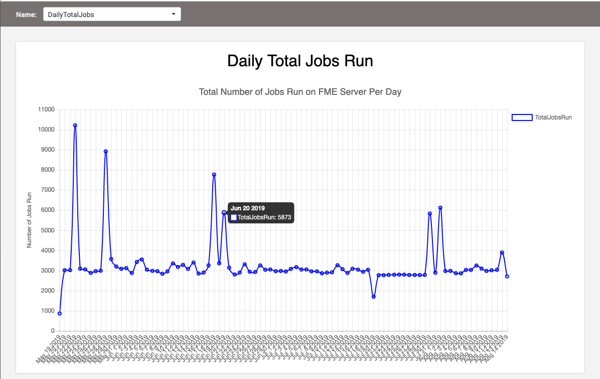

# Server Dashboards #

The FME Server Dashboards panel is used to display reports that show the general health of the FME Server installation.

There are five default reports that exist in FME Server:

Each of these reports are simple static HTML files. Clicking on any of the links will open the HTML file in your web browser and display the report. Here is an example of the Job Report HTML file:

In the above image, for example, the report shows how many jobs have been run on FME Server per day.

---

<!--Person X Says Section-->

<table style="border-spacing: 0px">
<tr>
<td style="vertical-align:middle;background-color:darkorange;border: 2px solid darkorange">
<i class="fa fa-quote-left fa-lg fa-pull-left fa-fw" style="color:white;padding-right: 12px;vertical-align:text-top"></i>
Police Chief Webb-Mapp says...
</td>
</tr>

<tr>
<td style="border: 1px solid darkorange">

These reports are generated using - what else - FME workspaces! These workspaces use the HTMLReportGenerator transformer and HTML format writer to create the graphs shown in reports.
  These are fairly simple workspaces and it is entirely possible to create your own reports - preferably by using an existing report as a template workspace. The Dashboards documentation explains how, but - in brief - any HTML document that is written to the folder resources\dashboards\dashboards will appear as a report in the Dashboards panel of the server web interface.

</td>
</tr>
</table>

---

### Generating and Using Reports ###

The reports in the dashboard panel are not generated and/or updated by default. To have them appear - and be updated - you must carry out the following steps:

1. In the FME Server web interface, click *Run Workspaces* and choose the **Dashboards** repository.
2. Run the workspace **JobHistoryStatisticsGathering.fmw** to generate updated statistics.
3. Return to *Run Workspaces* and choose the *Dashboards* repository again.
4. Run the workspace for the report you wish to add/update; for example **DailyTotalJobs.fmw**.
5. Click *Dashboards*.
6. Click on the chosen report to see the latest statistics.

The workspace *JobHistoryStatisticsGathering.fmw* is also set up to run on a schedule. The schedule is called *DashboardStatisticsGathering*, runs every 24 hours, and is set to **Disabled** by default. Therefore to get daily statistics - automatically - requires this schedule to be first enabled.
