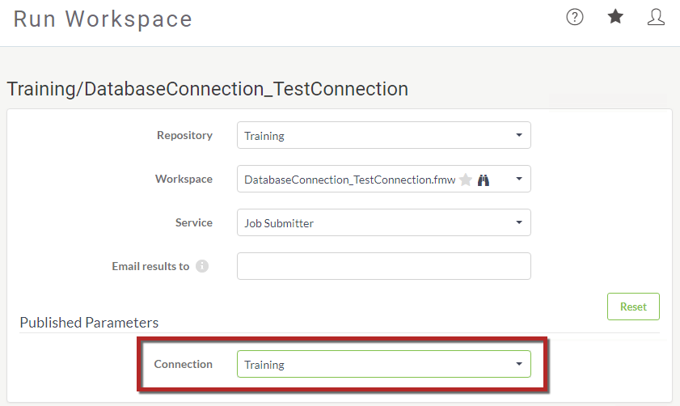
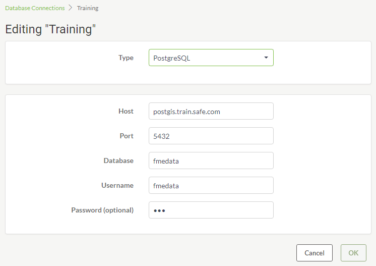

# Database Connections #

Many workspaces that are run from FME Server require you to connect to and authenticate a database service. For example, a workspace that contains an Oracle Spatial Relational reader requires you to provide a service name, username, and password to connect to an Oracle Spatial Relational dataset.

FME Server allows you to store these authentication parameters as self-contained objects, and the *Database Connections* page provides a convenient and secure way to manage them. When you run a workspace from FME Server that requires a database connection, you can reference the connection name, rather than re-entering the connection parameters. If the connection parameters change, you can edit them in one place, rather than in each workspace that uses the connection.

### Using Database Connections ###

When you run a workspace, any connections that are compatible with the database type in the workspace appear in the Connection drop-down list, under Published Parameters.

### Adding Database Connections ###

There are two ways to add database connections:

1. **On the Database Connections page**: Click *New*. Or, check the box beside an existing connection and click *Duplicate*. On the Create New (or Duplicate) Database Connection page, provide a name for the connection, and specify the type of database. Provide the remaining connection and authentication parameters, depending on type. Click OK.

2. **From FME Workbench**: When you upload a workspace that contains a database connection to FME Server, you can specify whether to upload the connection along with the workspace, or use a connection that already exists on FME Server. If you choose to upload the connection, it is added to this page.

### Editing Database Connections ###

Click on a connection name. On the *Editing Database Connection* page, specify the new parameters, and click *OK*.

### Sharing Database Connections ###

To share a connection, click the *Share with Others* icon. Through sharing, you can grant levels of permissions on an item to other users. You can share an item if you own it, or if you are a user with Manage Security permissions, such as an administrator. For more information about sharing and ownership, see Role-Based and User-Based Access Control.

### Removing Database Connections ###

Check the box beside one or more connections you want to remove, and click *Remove*. In the confirmation dialog, click *OK*.
