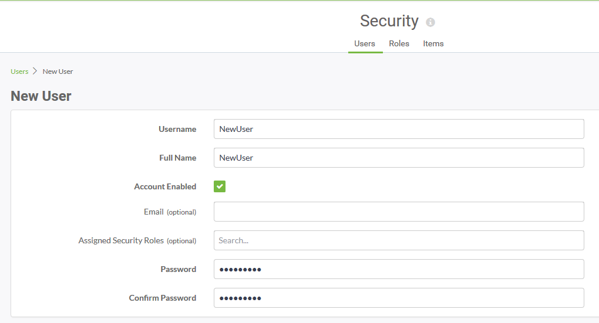
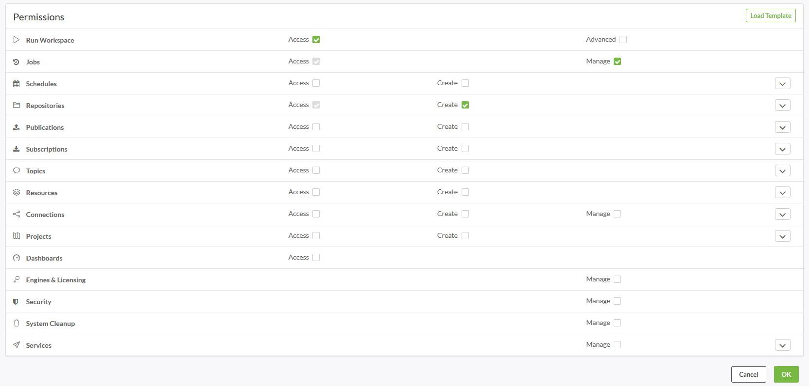
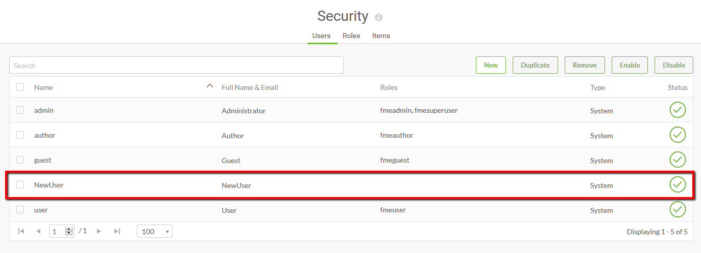

# Exercise: Creating a New User and Limiting Their Actions #

Your company has recently hired a new analyst who will be accessing FME Server. The new employee doesn't quite fit into the current FME Server user roles you have in place so you need to create a new user role for them.

1. Click on the *Security* page to see a list of your current users.

2. On the *Users* page, click **New** to add a new user.

3. Fill in the *New User* parameters to create your new user's login information.

4. In the *Permissions* section you can decide whether the new user will be able to Access, Create or Manage one or more FME services. You also have the option to copy permissions from a role by selecting the **Load Template** button.

In the following image, the *NewUser* user has been given Access to Run Workspace, Access and Manage to Jobs, and Access and Create to Repositories.

5. Click **OK** to create the user.

6. Back on the *Users* page you will new see your new user.

7. Log out of your admin account and sign in with your *NewUser* account. Your homepage should only have limited options on the side bar which reflect the *NewUser* permissions.

---

<!--Exercise Congratulations Section--> 

<table style="border-spacing: 0px">
<tr>
<td style="vertical-align:middle;background-color:darkorange;border: 2px solid darkorange">
<i class="fa fa-thumbs-o-up fa-lg fa-pull-left fa-fw" style="color:white;padding-right: 12px;vertical-align:text-top"></i>
CONGRATULATIONS
</td>
</tr>

<tr>
<td style="border: 1px solid darkorange">

You have now added a new user and personalized permissions!

</td>
</tr>
</table>

---