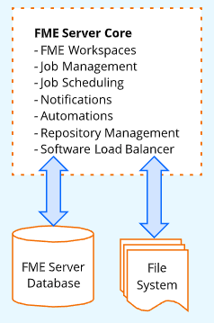

# FME Workspaces and FME Server

FME Server is a model-driven architecture, because its processes are expressed as a model. In FME, these models are better known as **workspaces**.

Workspaces are created – we call it “authored” – using FME Desktop. In particular, the **FME Workbench** application is used. FME Workbench is a client of FME Server, and so they form a client-server pair. However, both share the same core engine and process data the same way.

---

<!--Person X Says Section-->

<table style="border-spacing: 0px">
<tr>
<td style="vertical-align:middle;background-color:darkorange;border: 2px solid darkorange">
<i class="fa fa-quote-left fa-lg fa-pull-left fa-fw" style="color:white;padding-right: 12px;vertical-align:text-top"></i>
Police-Chief Webb-Mapp says...
</td>
</tr>

<tr>
<td style="border: 1px solid darkorange">

Hello, I'm the police chief and responsible for guiding you through this chapter. 
  Let's make sure you get the terminology right. The application itself is called FME “Workbench”, but the process defined in the canvas window is called a “Workspace”. The terms are so similar that they are easily confused, but please don't, otherwise I will have to send my grammar squad to arrest you!

</td>
</tr>
</table>

---

Because Workbench is a client of FME Server, it may be used to transfer authored workspaces to and from an FME Server. We call this transfer **publishing**. 

FME Workbench has the ability to:

- Author a translation workspace
- Publish a workspace (transfer it to FME Server)
- Republish a workspace (upload a previously published workspace)
- Download a workspace (retrieve it from FME Server)

The ability to transfer a workspace back to FME Workbench means workspaces can be downloaded for editing and maintenance, then published back to FME Server. 

---

## Repositories ##

Workspaces are stored on FME Server in devices called **repositories**. Each FME Server may have multiple repositories, but any workspace can only belong to one of them.

A repository consists of two parts. Workspaces published to FME Server are held on a file-based part of the repository. 

Metadata related to the workspace is held separately in a repository database. This metadata includes information about the contents of the workspace; for example source and destination datasets, workspace feature types, and published parameters.

Repositories are managed by the FME Core. They can be accessed (by authors and administrators) through the FME Server web interface.

---

<table style="border-spacing: 0px">
<tr>
<td style="vertical-align:middle;background-color:darkorange;border: 2px solid darkorange">
<i class="fa fa-quote-left fa-lg fa-pull-left fa-fw" style="color:white;padding-right: 12px;vertical-align:text-top"></i>
Police Chief Webb-Mapp says…
</td>
</tr>

<tr>
<td style="border: 1px solid darkorange">

Security in FME Server is very important, and never more so than for repositories.
  You can think of each repository as being like a folder on a file-system, with the same ability to grant access rights to individuals and groups. So, for each repository you create, be sure to check the security settings. If you don’t then end-users may not get access to the repository!

</td>
</tr>
</table>

---

<!--Person X Says Section-->

<table style="border-spacing: 0px">
<tr>
<td style="vertical-align:middle;background-color:darkorange;border: 2px solid darkorange">
<i class="fa fa-quote-left fa-lg fa-pull-left fa-fw" style="color:white;padding-right: 12px;vertical-align:text-top"></i>
Miss Vector says...
</td>
</tr>

<tr>
<td style="border: 1px solid darkorange">

If I wanted to find out about workspaces stored in a repository - for example I'm building a tool to catalogue my workspaces - what is the best way to do it?
  <a href="http://52.73.3.37/fmedatastreaming/Manual/QAResponse2017.fmw?chapter=21&question=3&answer=1&DestDataset_TEXTLINE=C%3A%5CFMEOutput%5CQAResponse.html">1. Use the FME Server REST API</a>
 <a href="http://52.73.3.37/fmedatastreaming/Manual/QAResponse2017.fmw?chapter=21&question=3&answer=2&DestDataset_TEXTLINE=C%3A%5CFMEOutput%5CQAResponse.html">2. Scrape the contents of the Server repository page</a>
 <a href="http://52.73.3.37/fmedatastreaming/Manual/QAResponse2017.fmw?chapter=21&question=3&answer=3&DestDataset_TEXTLINE=C%3A%5CFMEOutput%5CQAResponse.html">3. Get a file listing from the repository folder</a>
 <a href="http://52.73.3.37/fmedatastreaming/Manual/QAResponse2017.fmw?chapter=21&question=3&answer=4&DestDataset_TEXTLINE=C%3A%5CFMEOutput%5CQAResponse.html">4. Connect to the FME Server database to query it directly</a>

</td>
</tr>
</table>
