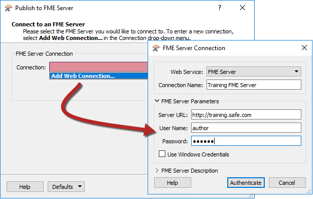
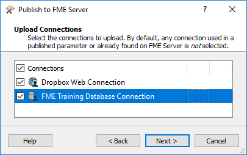

## Transferring Workspaces ##

The functionality for publishing or downloading workspaces is accessed in FME Workbench either through the menubar:

...or the toolbar:

---

### Connecting to Server ###

The Publish to FME Server tool in Workbench opens a simple wizard interface, the first dialog of which defines a connection to Server.

Adding a web connection opens a dialog with fields in which to define connection credentials. These connection details are saved so that they can be reused in the future simply by picking from the drop-down list:

---

<!--New Section-->

<table style="border-spacing: 0px">
<tr>
<td style="vertical-align:middle;background-color:darkorange;border: 2px solid darkorange">
<i class="fa fa-bolt fa-lg fa-pull-left fa-fw" style="color:white;padding-right: 12px;vertical-align:text-top"></i>
NEW
</td>
</tr>

<tr>
<td style="border: 1px solid darkorange">

The ability to save and store multiple Server connections is new for FME2017.
 For older versions of FME you may save a set of parameters as the default, but one set only.

</td>
</tr>
</table>

---

### Repository Selection ###

The next dialog defines the repository in which to store the workspace:

Either an existing repository can be used, or a new one created. The workspace name can also be edited, even making it different to what it is saved as locally.

---

### Connections Upload ###

This dialog only appears when there are database and/or web connections that need to be uploaded with the workspace.

This workspace contains both a database connection and a web connection that need to be uploaded to function on FME Server. Notice that the *OAuth* web connection needs the service to be added to FME Server, and will also require additional authentication before FME Server will be allowed to use it.

The database connection requires no further authentication, but care must be taken not to accidentally overwrite an existing database connection with the same name that might already be defined on FME Server.

---

### Workspace Registration ###

The final dialog defines which services the workspace is to be registered against. A workspace may be registered for use with any number of these services.

The Job Submitter service allows FME Server to run a workspace as-is. This is the closest to running a workspace on FME Desktop. All inputs and outputs are defined in the workspace so data is simply written out and not streamed or delivered in any other manner.

Job submission is ideal for testing workspaces, and for running large-scale and batch translations that make use of the server process queue.

---

## Republishing a Workspace ##

Once a workspace has been published, the republish tool becomes active. Further updates to the workspace (within the same FME Workbench session) can then be uploaded with a single click.

The same parameters are used as before. If changes need to be made to these parameters, then the full publishing wizard should be used.

---

## Downloading a Workspace ##

Workbench can also download a workspace held in an FME Server repository. This is usually done in order to make edits to the workspace. Note that downloaded workspaces are copies of the original, which remains in the FME Server repository.

The downloading wizard begins with the same connection dialog as the publishing wizard. From there, the second – and final – dialog page is a repository and workspace selection tool:

The user is then prompted for a location to save the workspace. The default (on Windows) is &lt;user&gt;/FME/My FME Server Workspaces. The workspace – and any resources – are then downloaded and saved to that location.

Once downloaded, the workspace is automatically opened within Workbench for editing.

---

<table style="border-spacing: 0px">
<tr>
<td style="vertical-align:middle;background-color:darkorange;border: 2px solid darkorange">
<i class="fa fa-quote-left fa-lg fa-pull-left fa-fw" style="color:white;padding-right: 12px;vertical-align:text-top"></i>
Ms. Analyst says…
</td>
</tr>

<tr>
<td style="border: 1px solid darkorange">

Besides workspaces, it’s also possible to publish/download FME custom transformers and custom formats to/from a server repository.

</td>
</tr>
</table>
