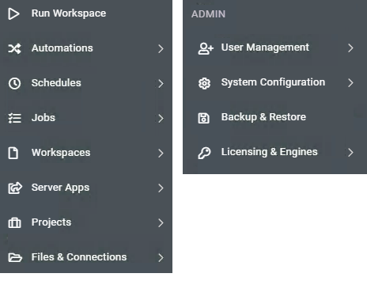

# Introduction to the FME Server Web Interface

Although translations are authored in FME Workbench, the core tools of FME Server are accessed through a web-based interface.

The web interface is accessed through the URL **http://&lt;servername&gt;:&lt;port&gt;/fmeserver** (the port may be optional) or through the start menu:

The web interface for FME Server looks like this:

The main part of the interface displays a page of content that contains information, reports, parameters, and other components. The landing page, for example, has shortcuts to lists of recent jobs, projects, automations, and favorite workspaces.

The left-hand side of the interface contains a set of menus. Selecting a menu item changes the content of the page to match the menu item chosen.

## Web Interface Menu ##

In general, FME Server functionality is accessed through the web interface menu. There are two main sections in this menu:

The first section relates to the **use** of FME Server. It has - among others - options for running a workspace, accessing repositories, setting up schedules, and reviewing job history.

The next section of the menu relates to the **administration** of FME Server. It has - among others - options for managing engines, setting up security, and creating system backups.

---

<!--New Section-->

<table style="border-spacing: 0px">
<tr>
<td style="vertical-align:middle;background-color:darkorange;border: 2px solid darkorange">
<i class="fa fa-bolt fa-lg fa-pull-left fa-fw" style="color:white;padding-right: 12px;vertical-align:text-top"></i>
NEW
</td>
</tr>

<tr>
<td style="border: 1px solid darkorange">

Notice the entry for Automations in the menu pictured above? That's a brand new feature in FME Server 2019. It provides an easy-to-use graphical interface to set up ways to automate your workspaces. We'll be learning more about that later on in this course.

</td>
</tr>
</table>

---

There are a couple of additional menus located in the top-right part of the interface:

The first provides access to help tools for authors, users, administrators, and developers. And the second provides options for managing your user account options.

---

<!--New Section-->

<table style="border-spacing: 0px">
<tr>
<td style="vertical-align:middle;background-color:darkorange;border: 2px solid darkorange">
<i class="fa fa-bolt fa-lg fa-pull-left fa-fw" style="color:white;padding-right: 12px;vertical-align:text-top"></i>
NEW
</td>
</tr>

<tr>
<td style="border: 1px solid darkorange">

The Manage Tokens option in the user settings menu is new for 2019. In the past a user account could only save a single access token (used to authenticate with FME Server without using a password). Now, a user account can create multiple tokens and manage them from that page.
 Tokens are particularly useful when interacting with FME Server's REST API. They are covered in more detail in the <a href="https://www.safe.com/training/live-online/">FME Server REST API Training course</a>

</td>
</tr>
</table>

---
