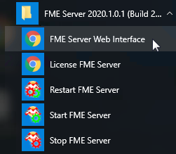

# Introduction to the FME Server Web Interface

Although translations are authored in FME Workbench, the core tools of FME Server are accessed through a web-based interface.

The web interface is accessed through the URL **&lt;servername&gt;:&lt;port&gt;/fmeserver** (the port may be optional) or through the start menu:

The web interface for FME Server looks like this:

The main part of the interface displays a page of content that contains information, reports, parameters, and other components. The landing page, for example, has shortcuts to lists of recent jobs, recent projects, and favorite workspaces.

The left-hand side of the interface contains a set of menus. Selecting a menu item changes the content of the page to match the menu item chosen.

## Web Interface Menu ##

In general, FME Server functionality is accessed through the web interface menu. There are two main sections in this menu:

The first section relates to the **use** of FME Server. It has - among others - options for running a workspace, accessing repositories, setting up schedules, and reviewing job history.

The next section of the menu relates to the **administration** of FME Server. It has - among others - options for managing engines, setting up security, and creating system backups.

---

<!--New Section-->

<table style="border-spacing: 0px">
<tr>
<td style="vertical-align:middle;background-color:darkorange;border: 2px solid darkorange">
<i class="fa fa-bolt fa-lg fa-pull-left fa-fw" style="color:white;padding-right: 12px;vertical-align:text-top"></i>
NEW
</td>
</tr>

<tr>
<td style="border: 1px solid darkorange">

Notice the Workspace Viewer in the menu pictured above? That's a brand new feature in FME Server 2018 that allows you to get a read-only view of any workspaces published to FME Server. It lets you see all the readers, writers, transformers, and parameters set within the workspace:
 

</td>
</tr>
</table>

---

There is an additional menu located in the top-right part of the interface:

It provides access to help tools for authors, users, administrators, and developers. It also a shortcut to view any workspaces you have favorited and allows access to your user account options.

---

<!--New Section-->

<table style="border-spacing: 0px">
<tr>
<td style="vertical-align:middle;background-color:darkorange;border: 2px solid darkorange">
<i class="fa fa-bolt fa-lg fa-pull-left fa-fw" style="color:white;padding-right: 12px;vertical-align:text-top"></i>
NEW
</td>
</tr>

<tr>
<td style="border: 1px solid darkorange">

The web interface has had a style refresh for 2018. One big change is the introduction of Dark Mode for the interface. You can find the option to enable or disable it in your User Options menu.

</td>
</tr>
</table>

---

## Getting Started ##

Getting started with the FME Server web interface requires familiarity with three key pages:

- Engines and Licensing
- Run Workspace
- Jobs  
