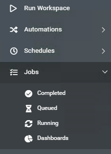
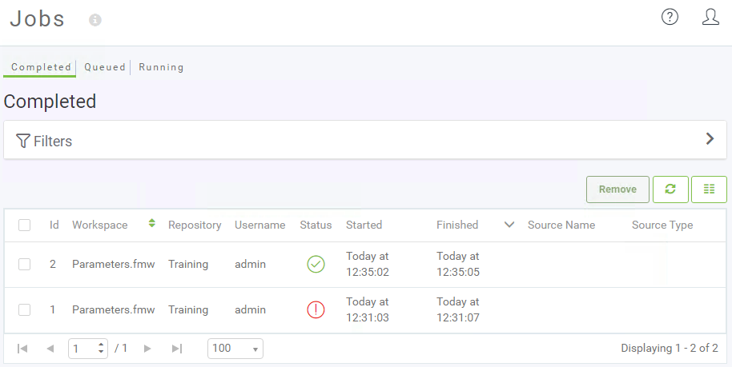
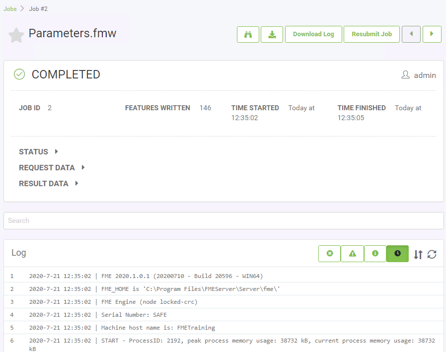

## Jobs ##

Information about all jobs that are running or have run on FME Server will be stored so you can easily view activity on the Server. To access this,  choose the menu option for Jobs and select Completed, Queued, or Running jobs to view:

This opens the Jobs page, where you can see the status of jobs, whether Completed, Queued, or Running:

This allows you to check that the translation you just ran finished successfully. You can also find jobs that are currently running, jobs that are queued to run, or any jobs that have completed running.

The Filters menu at the top allows you to filter by User, Status, Engine, Repository, Workspace, Source Type, and Source Name. This is especially useful when the job history table runs to thousands of jobs. Filtering helps to find information about a specific job or, for example, to quickly find all jobs that resulted in a failure message.

### Completed Jobs ###

Clicking on a completed job opens up a page showing information about that job; such as Job ID, Job Priority, Time Started, Features Written and which user ran the job. You can also view, filter, and search the job log.

A series of buttons allow you to download the FME log from the translation, resubmit the job with a single click, view the workspace, and download the workspace:

This allows you to confirm that the workspace functioned correctly, with the same level of detail as you could find within FME Desktop.

---

### Queued and Running Jobs ###

Queued and Running jobs can be listed so that you can see what jobs the Server is currently handling. You can filter the jobs by a particular username.

One particularly useful feature is that these pages can be used to cancel jobs if they are no longer required.

---

<!--Tip Section-->

<table style="border-spacing: 0px">
<tr>
<td style="vertical-align:middle;background-color:darkorange;border: 2px solid darkorange">
<i class="fa fa-info-circle fa-lg fa-pull-left fa-fw" style="color:white;padding-right: 12px;vertical-align:text-top"></i>
TIP
</td>
</tr>

<tr>
<td style="border: 1px solid darkorange">

If your jobs are being queued regularly, talk to your FME Server Administator about different options like Job Queues, decicated engines or scheduling larger tasks to run outside of regular office hours.

</td>
</tr>
</table>
