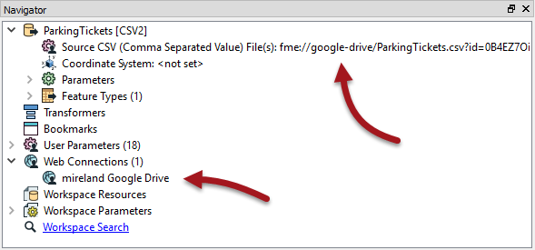
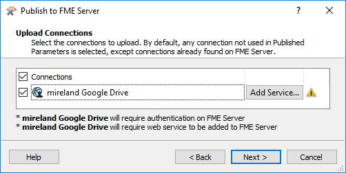
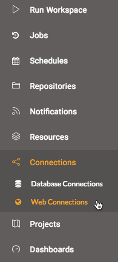
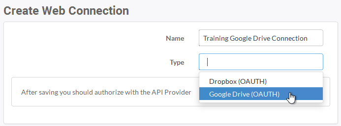

## Using Web Connections

Just as for databases, when the source data for a dataset is a web service, FME is capable of storing connection parameters in a secure container. That container can be either published to FME Server or recreated on it.

### What is a Web Connection? ###

Web connections are containers for a set of web service connection parameters. These parameters include the service, username, password (or authenticated connection), and others that vary according to the service type.

The two main advantages of web connections are:

- Connection parameters are no longer embedded in a workspace, meaning less of a security risk
	- For example, your parameters would not be exposed to anyone who downloaded the workspace
- Connection parameters can be reused among multiple workspaces
	- For example, two workspaces that use the same web service can use the same connection

Web connections can be published with a workspace from FME Desktop, or they can be added directly within FME Server.

---

### Creating a Web Connection ###

Creating a web connection often starts in FME Desktop. They can be created using Tools &gt; FME Options &gt; Web Connections in the FME Workbench menubar. The defined connection can then be used in a reader, writer, or transformer.

For example, this workspace reads a CSV dataset using a connection to a Google Drive web service, as seen in the reader parameters and a list of web connections:

When the workspace is published to FME Server a new dialog asks the author whether to also publish the web connection:

The connection is then added to the connections container on FME Server.

---

<!--Person X Says Section-->

<table style="border-spacing: 0px">
<tr>
<td style="vertical-align:middle;background-color:darkorange;border: 2px solid darkorange">
<i class="fa fa-quote-left fa-lg fa-pull-left fa-fw" style="color:white;padding-right: 12px;vertical-align:text-top"></i>
Police Chief Webb-Mapp says...
</td>
</tr>

<tr>
<td style="border: 1px solid darkorange">

Note that - for web services - simply uploading them to FME Server is not enough. Before you use a web connection for the first time from FME Server, you must authorize it, even if it has already been authorized in the workspace from FME Desktop.
  
  <strong>It's also important</strong> to know that the deployment you are using affects authentication. For example, by default you can't authenticate OAuth2 web services like Google Drive on an FME Server that uses a local host name. Requests for authorization that pass through a web server must come from a public domain.
  Setting up the requirements for OAuth authentication is a task best left to system administrators. See the FME Server Administrator's Guide for more information on how to carry it out. 

</td>
</tr>
</table>

---

### Managing Web Connections ###

FME Server has a page for managing web connections, accessed through the main menu:

This page allows workspace authors - but usually administrators - to create new connections, copy existing connections, delete existing connections, or edit existing connections.

Notice that a web connection of a specific type can only be added when that Web Service has already been added to the FME Server; for example, in the above only Dropbox and Google Drive connections can be created because only those two services already exist on FME Server.

Connections can also be authorized by clicking the Authorize button:

...after which you carry out the authorization using the standard method for that particular service inside a pop-up window.

---

### Using Web Connections ###

When a workspace is run, if it has a transformer or reader that references a web service then it will run correctly, just as on a Desktop installation.

In the published parameters on Server, the web connection is defined in the source dataset URL:

---

<!--Person X Says Section-->

<table style="border-spacing: 0px">
<tr>
<td style="vertical-align:middle;background-color:darkorange;border: 2px solid darkorange">
<i class="fa fa-quote-left fa-lg fa-pull-left fa-fw" style="color:white;padding-right: 12px;vertical-align:text-top"></i>
Sister Intuitive says...
</td>
</tr>

<tr>
<td style="border: 1px solid darkorange">

As with database connections, this functionality allows a workspace to be tested in FME Desktop using the author's connection parameters, but then switched to a general account once published to Server; all in a way that is both easy and secure. 

</td>
</tr>
</table>

