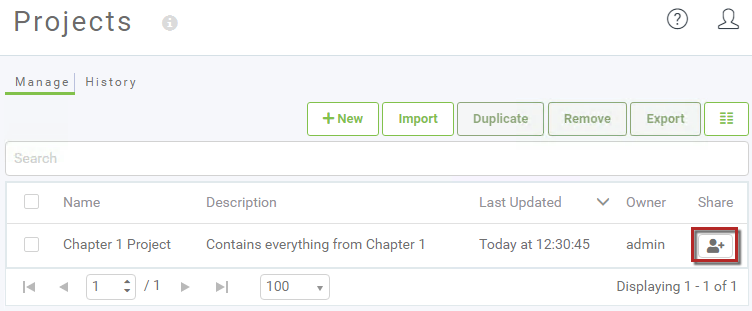
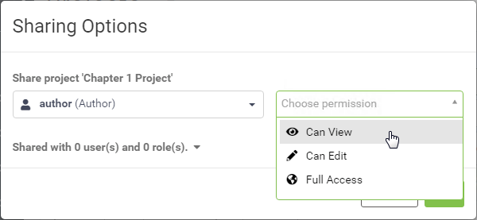
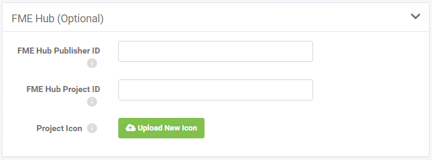

# Sharing a Project

A project is often carried out by a group of FME users and authors. Therefore it makes sense that a Project can be shared among multiple FME users.

## Share Project ##

Sharing a project is carried out on the Projects page (accessed via the main menu) by simply clicking the Share with Others button for the Project to be shared:

You don't even need to select the Project first.

The Share with Others tool works the same way as the tool for sharing a repository: it opens a pop-up dialog in which to select a user and choose the level of permission that you wish to give to them:

Remember, FME Security is based on users and roles. Roles are analogous to a group of users. When sharing a Project, the "user" field can be an individual user, or it can be applied to a particular role; for example, you can give the ability to view your project to anyone in the *fmeuser* role.

Sharing a Project gives the ability to access not just repositories and workspaces, but all of the components related to that Project.

## Share on FME Hub ##

FME Server Projects can be shared on the FME Hub.  Check out <a href="https://hub.safe.com/?page=1&page_size=10&types=fme_projects&order=updated_at_desc">this list of projects</a> that are already available for download to import into your own FME Server.

When creating a project, there is a set of FME Hub specific parameters that you can fill in when creating a Project to prepare it for publishing to the FME Hub:

