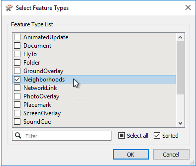
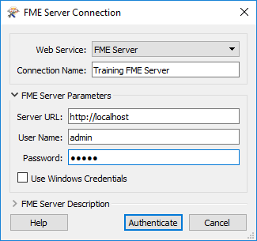
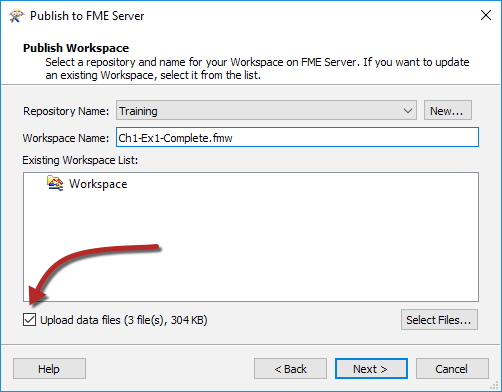
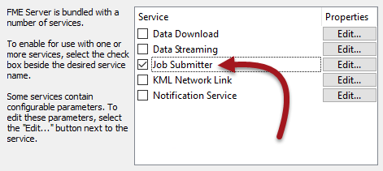

<!--Instructor Notes-->
<!--This exercise uses a basic amount of FME Workbench as a test for students-->
<!--If students have problems now, it is unlikely they will have much success at further exercises-->

<!--Exercise Section-->

<table style="border-spacing: 0px;border-collapse: collapse;font-family:serif">
<tr>
<td width=25% style="vertical-align:middle;background-color:darkorange;border: 2px solid darkorange">
<i class="fa fa-cogs fa-lg fa-pull-left fa-fw" style="color:white;padding-right: 12px;vertical-align:text-top"></i>
Exercise 1
</td>
<td style="border: 2px solid darkorange;background-color:darkorange;color:white">
Daily Database Updates: Publishing a Workspace
</td>
</tr>

<tr>
<td style="border: 1px solid darkorange; font-weight: bold">Data</td>
<td style="border: 1px solid darkorange">Firehalls (GML) Neighborhoods (KML)</td>
</tr>

<tr>
<td style="border: 1px solid darkorange; font-weight: bold">Overall Goal</td>
<td style="border: 1px solid darkorange">Create a workspace to read and process departmental data and publish it to FME Server</td>
</tr>

<tr>
<td style="border: 1px solid darkorange; font-weight: bold">Demonstrates</td>
<td style="border: 1px solid darkorange">Publishing a workspace to FME Server</td>
</tr>

<tr>
<td style="border: 1px solid darkorange; font-weight: bold">Start Workspace</td>
<td style="border: 1px solid darkorange">None</td>
</tr>

<tr>
<td style="border: 1px solid darkorange; font-weight: bold">End Workspace</td>
<td style="border: 1px solid darkorange">C:\FMEData2018\Workspaces\ServerAuthoring\Basics-Ex1-Complete.fmw</td>
</tr>

</table>

---

For the exercises in this chapter, you are a technical analyst in the GIS department of your local city. You have plenty of experience using FME Desktop, and your department is now investigating FME Server to evaluate its capabilities.

There are many departments within the city, and one of your tasks is to take the data from each department and merge it together into a single, corporate database.

Because each department produces their datasets in a different format and style, you use FME for this task, and carry it out on a weekly basis.   

One of the reasons for purchasing FME Server is to automate this procedure, so let's start implementing that.

---

<!--Person X Says Section-->

<table style="border-spacing: 0px">
<tr>
<td style="vertical-align:middle;background-color:darkorange;border: 2px solid darkorange">
<i class="fa fa-quote-left fa-lg fa-pull-left fa-fw" style="color:white;padding-right: 12px;vertical-align:text-top"></i>
Police Chief Webb-Mapp says...
</td>
</tr>

<tr>
<td style="border: 1px solid darkorange">

If you have lots of experience with FME Workbench - <strong>and if your instructor agrees</strong> - simply open the workspace listed in the header above and skip to step 8.

</td>
</tr>
</table>

---

 **1) Inspect Source Data**
 For the sake of simplicity - and because this course is about Server, not Desktop - we'll just use a couple of datasets. These are:

<table style="border: 0px">
<tr>
<td style="font-weight: bold">Reader Format</td>
<td style="">GML (Geography Markup Language)</td>
</tr>
<tr>
<td style="font-weight: bold">Reader Dataset</td>
<td style="">C:\FMEData2018\Data\Emergency\FireHalls.gml</td>
</tr>

<table style="border: 0px">
<tr>
<td style="font-weight: bold">Reader Format</td>
<td style="">Google KML</td>
</tr>
<tr>
<td style="font-weight: bold">Reader Dataset</td>
<td style="">C:\FMEData2018\Data\Boundaries\VancouverNeighborhoods.kml</td>
</tr>

</table>

Start the FME Data Inspector by selecting it from the Windows start menu. Inspect all of the source data to become familiar with it. The VancouverNeighborhoods has a different coordinate system than the other dataset so be careful and turn on a background map if you want to view all the data together.

The goal of our translation is to convert the Firehalls and Neighborhoods to a database, dividing the firehalls data up into a separate table per neighborhood.

 **2) Start FME Workbench**
 Start FME Workbench by selecting it from the Windows start menu. Begin with an empty canvas by closing any existing workspace (if necessary) and clicking on the Main tab.

Now select Readers &gt; Add Reader to start adding a reader to the workspace. When prompted, enter the following details for the Firehalls dataset:

<table style="border: 0px">

<tr>
<td style="font-weight: bold">Reader Format</td>
<td style="">GML (Geography Markup Language)</td>
</tr>

<tr>
<td style="font-weight: bold">Reader Dataset</td>
<td style="">C:\FMEData2018\Data\Emergency\FireHalls.gml</td>
</tr>

</table>

Click OK to add the Reader to the workspace, which will now look like this:

 **3) Add KML Data**
 Now repeat the process one more time to add a reader for the KML dataset:

<table style="border: 0px">

<tr>
<td style="font-weight: bold">Reader Format</td>
<td style="">Google KML</td>
</tr>

<tr>
<td style="font-weight: bold">Reader Dataset</td>
<td style="">C:\FMEData2018\Data\Boundaries\VancouverNeighborhoods.kml</td>
</tr>

</table>

While adding the dataset, you'll be prompted which feature types (layers) to add to the workspace. The only one we need is called Neighborhoods:

The workspace should now look like this:

 **4) Add Reprojector Transformer**
 Add a Reprojector transformer to the workspace. You can do this by simply clicking on the canvas and starting to type Reprojector. Connect it to the Neighborhoods feature type:

Check the transformer's parameters and set the Destination Coordinate System to UTM83-10:

This will ensure the neighborhoods data is in the same coordinate system as the rest of the data.

 **5) Add Writer**
 Now we should add a writer to the workspace. For now we'll just set up a dummy writer until we are more familiar with FME Server. So select Writers &gt; Add Writer on the menubar to add a writer and set it up with the following parameters:

<table style="border: 0px">

<tr>
<td style="font-weight: bold">Writer Format</td>
<td style="">NULL (Nothing)</td>
</tr>

<tr>
<td style="font-weight: bold">Feature Class or Table Definition</td>
<td style="">Copy from Reader...</td>
</tr>

</table>

Click OK. When prompted, select both Firehalls and Neighborhoods as the feature types to add  and OK again:

The workspace will now look like this:

 **6) Add Clipper Transformer**
 Add a Clipper transformer to the workspace. This will be used to divide the firehall data by neighborhood. Again, you can do this by simply clicking on the canvas and starting to type Clipper.

Connect the Firehalls feature type to the Clipper:Clippee port and the Reprojector:Reprojected output to the Clipper:Clipper port. You may wish to rearrange the feature types (or the port order) to avoid overlapping connections:

Check the parameters for the Clipper transformer to ensure the Clipper Type is set to Multiple Clippers. That's because there are multiple neighborhood features to act as a clipper feature.

Also put a check mark in the box labelled Merge Attributes, so that the neighborhood name is copied from the neighborhood features to the firehall features.

Connect the Clipper:Inside port to the Firehalls feature type on the writer. Also make a connection from the Reprojector:Reprojected port to the Neighborhoods feature type:

 **7) Set Firehall Feature Type Name**
 Finally, let's set the Feature Type Name for the Firehalls writer feature type.

Inspect its parameters and under Feature Type Name either enter:

`FireHalls-@Value(NeighborhoodName)`

...or click the dropdown and use the text editor dialog to enter that value. This will cause firehalls in each different neighborhood to be written to a different table/layer.

Save the workspace.

 **8) Run Workspace**
 Here comes the Server part of the process.

The first step, one which is very important, is to run the workspace. If the workspace won't run on FME Desktop then it is not likely to run on FME Server.

Run the workspace. Inspect the log. You should get six tables of firehalls and one of neighborhoods:

 **9) Publish to Server: Create Connection**
 Now we have a workspace and know that it works correctly, let's publish it to FME Server.

In FME Workbench, choose File &gt; Publish to FME Server from the menubar. As this is the first time we've connected to our FME Server we'll need to create a new connection, so select Add Web Connection from the dropdown menu.

In the dialog that opens enter the parameters provided by your training instructor. In most cases the parameters will be as follows:

- **FME Server URL:** http://localhost
- **Username:** admin
- **Password:** admin

You may or may not (probably not) need to enter a port number with the hostname, depending on how the system is set up.

Click Authenticate to confirm the connection and return to the previous dialog. Make sure the newly defined connection is selected and click Next to continue.

 **10) Publish to Server: Repository Selection**
 The next dialog prompts you to choose a repository in which to store the workspace.

For this exercise we’ll create a new repository by clicking the New button. When prompted enter the name Training.

Click OK to close the Create New Repository dialog. Enter a name for the workspace if it doesn't already have one. Place a checkmark against the Upload Data Files option:

Then click Next to continue the wizard.

 **11) Publish to Server: Select Service**
 In the final screen of the wizard we can register the workspace for use with various services.

Select the Job Submitter service as this is the only service we are using for now:

... and click Publish to complete publishing the workspace.

After a workspace is transferred to Server, the log window displays a message reporting which workspace has been published to which repository and for which services. It will look something like this:

---

<!--Exercise Congratulations Section-->

<table style="border-spacing: 0px">
<tr>
<td style="vertical-align:middle;background-color:darkorange;border: 2px solid darkorange">
<i class="fa fa-thumbs-o-up fa-lg fa-pull-left fa-fw" style="color:white;padding-right: 12px;vertical-align:text-top"></i>
CONGRATULATIONS
</td>
</tr>

<tr>
<td style="border: 1px solid darkorange">

By completing this exercise you have learned how to:
 
<ul><li>Create a workspace converting data to a Null (dummy) format</li>
<li>Use a Clipper to transfer attribute values from one feature to another</li>
<li>Rename output layers according to the value of an attribute</li>
<li>Publish a workspace to FME Server using the Publishing Wizard</li>
<li>Create a repository on FME Server using the Publishing Wizard</li>
<li>Register a workspace with the Job Submitter service using the Publishing Wizard</li></ul>

</td>
</tr>
</table>
