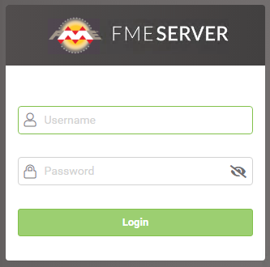
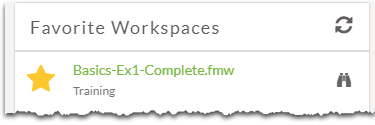
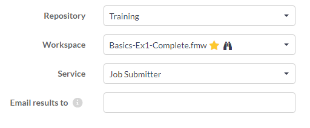

<!--Exercise Section-->

<table style="border-spacing: 0px;border-collapse: collapse;font-family:serif">
<tr>
<td width=25% style="vertical-align:middle;background-color:darkorange;border: 2px solid darkorange">
<i class="fa fa-cogs fa-lg fa-pull-left fa-fw" style="color:white;padding-right: 12px;vertical-align:text-top"></i>
Exercise 2
</td>
<td style="border: 2px solid darkorange;background-color:darkorange;color:white">
Daily Database Updates: Running a Workspace
</td>
</tr>

<tr>
<td style="border: 1px solid darkorange; font-weight: bold">Data</td>
<td style="border: 1px solid darkorange">Firehalls (GML) Neighborhoods (KML)</td>
</tr>

<tr>
<td style="border: 1px solid darkorange; font-weight: bold">Overall Goal</td>
<td style="border: 1px solid darkorange">Create a workspace to read and process departmental data and publish it to FME Server</td>
</tr>

<tr>
<td style="border: 1px solid darkorange; font-weight: bold">Demonstrates</td>
<td style="border: 1px solid darkorange">Examining the FME Server interface and running a workspace</td>
</tr>

<tr>
<td style="border: 1px solid darkorange; font-weight: bold">Start Workspace</td>
<td style="border: 1px solid darkorange">None</td>
</tr>

<tr>
<td style="border: 1px solid darkorange; font-weight: bold">End Workspace</td>
<td style="border: 1px solid darkorange">None</td>
</tr>

</table>

---

For the exercises in this chapter, you are a technical analyst in the GIS department of your local city. You have plenty of experience using FME Desktop, and your department is now investigating FME Server to evaluate its capabilities.

There are many departments within the city, and one of your tasks is to take the data from each department and merge it together into a single, corporate database.

Because each department produces their datasets in a different format and style, you use FME for this task, and carry it out on a weekly basis.   

After creating a workspace to carry out this translation, and publishing it to FME Server, you now wish to log in to Server to run that workspace.

 **1) Connect to Server**
 To log in to the server interface either select the Web Interface option from the start menu or - in your web browser - enter the address of your FME Server.

---

<table style="border-spacing: 0px">
<tr>
<td style="vertical-align:middle;background-color:darkorange;border: 2px solid darkorange">
<i class="fa fa-info-circle fa-lg fa-pull-left fa-fw" style="color:white;padding-right: 12px;vertical-align:text-top"></i>
TIP
</td>
</tr>

<tr>
<td style="border: 1px solid darkorange">

When FME Server is installed on either physical or virtual hardware, the address is http://&lt;servername&gt;/fmeserver
  If you are using FME Cloud, then the address is: http://&lt;servername&gt;.fmecloud.com/fmeserver

</td>
</tr>
</table>

---

This will open the web interface login screen for the FME Server being used. Bookmark this web address, since you will use this link quite often.

 **2) Log In to Server**
 In the User Login dialog, enter a username and password for your FME Server account. A common username/password combination for a training installation is admin/admin

Click the Login button.

 **3) Examine the User Interface**
 This is your primary method for interacting with FME Server.

Notice that one of the windows is labelled as Last Published Workspaces. Here you should be able to find the workspace published in Exercise 1:

Clicking the star icon will set this workspace as a favourite, making it available under the list of favourites panel:

We'll run the workspace shortly, but perhaps first we should make sure FME Server is running correctly (the fact that we could log in is a good sign) and that we are licensed and have engines running.

 **4) Examine the User Interface**
 Click Engines & Licensing on the ADMIN part of the interface menu. This will open up the licensing section. You should see a message informing you that FME Server is licensed and a list of the engines available:

---

<table style="border-spacing: 0px">
<tr>
<td style="vertical-align:middle;background-color:darkorange;border: 2px solid darkorange">
<i class="fa fa-info-circle fa-lg fa-pull-left fa-fw" style="color:white;padding-right: 12px;vertical-align:text-top"></i>
TIP
</td>
</tr>

<tr>
<td style="border: 1px solid darkorange">

If your machine is unlicensed, or is missing engines, then check with your instructor for troubleshooting tips.

</td>
</tr>
</table>

---

 **5) Run Workspace**
 Click the FME Server button in the very top-left of the interface. This will return you to the Server interface home page.

Click on the published workspace in the Favorite Workspaces panel to open the web page for this workspace.

The workspace page shows a few options, the first of which are for the repository, workspace, and service. These should already be filled in with values:

Because this workspace has a few published parameters, they are also listed; but we can ignore these for now (we'll deal with source datasets later in the course).

So, simply click the Run button to run the workspace. The workspace will run to completion and a message to that effect will appear:

 **6) Examine Jobs Page**
 Click Jobs --> Completed on the main menu. A list of previously run jobs will open, including the one we just ran:

Notice some interesting parts of the interface:

1. There are tabs to show Completed jobs (the default), Queued Jobs, and Running Jobs.
2. TThere are two drop-down lists: one that allows you to filter whose jobs are being shown and another that allows you to filter based on the Job Status
3. A different icon is used to indicate if jobs succeeded or failed.
4. The jobs are displayed in the chronological order in which they finished (whether successful or not).

Click on your job to inspect the results in more detail. You'll see a summary at the top showing the number of features written as well as the time it started and finished. There are more timing details under *STATUS* that include the time the job was submitted, queued, etc. Information about the exact request made to FME Server can be found under *REQUEST DATA*. And full results of the translation are under *RESULT DATA*.

You may also inspect the FME translation log file on this page.

---

<!--Person X Says Section-->

<table style="border-spacing: 0px">
<tr>
<td style="vertical-align:middle;background-color:darkorange;border: 2px solid darkorange">
<i class="fa fa-quote-left fa-lg fa-pull-left fa-fw" style="color:white;padding-right: 12px;vertical-align:text-top"></i>
Police Chief Webb-Mapp says...
</td>
</tr>

<tr>
<td style="border: 1px solid darkorange">

Remember, this workspace did not write any data, only sent it to a Null writer. So, for now, to view any results search for the summary in the log file.

</td>
</tr>
</table>

---

<!--Advanced Exercise Section-->

<table style="border-spacing: 0px">
<tr>
<td style="vertical-align:middle;background-color:darkorange;border: 2px solid darkorange">
<i class="fa fa-cogs fa-lg fa-pull-left fa-fw" style="color:white;padding-right: 12px;vertical-align:text-top"></i>
Advanced Exercise
</td>
</tr>

<tr>
<td style="border: 1px solid darkorange">

If you want to see a job in a different state then we'll have to slow this workspace down some.
  Open the workspace in FME Workbench and add a Decelerator transformer (say, before the Reprojector). Set it to delay the workspace by five (5) seconds per feature. Publish the workspace back to FME Server and re-run it.
  Now the workspace will take 30+ seconds to run and you should be able to find it under the Running state. Also, if you run it three or four times in quick succession, then you will have more jobs than engines and be able to find some jobs in the Queued state.   

</td>
</tr>
</table>

---

<!--Exercise Congratulations Section-->

<table style="border-spacing: 0px">
<tr>
<td style="vertical-align:middle;background-color:darkorange;border: 2px solid darkorange">
<i class="fa fa-thumbs-o-up fa-lg fa-pull-left fa-fw" style="color:white;padding-right: 12px;vertical-align:text-top"></i>
CONGRATULATIONS
</td>
</tr>

<tr>
<td style="border: 1px solid darkorange">

By completing this exercise you have learned how to:
 
<ul><li>Log in to FME Server and check that it is running and licensed</li>
<li>Locate a workspace using the Last Published list</li>
<li>Run a workspace and inspect the job history to confirm it ran correctly</li>

</td>
</tr>
</table>
