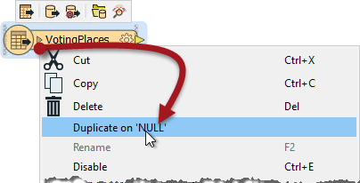
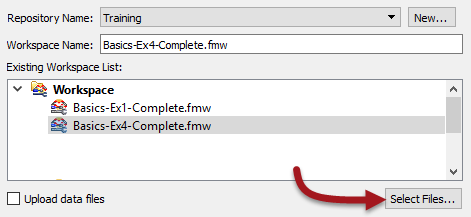
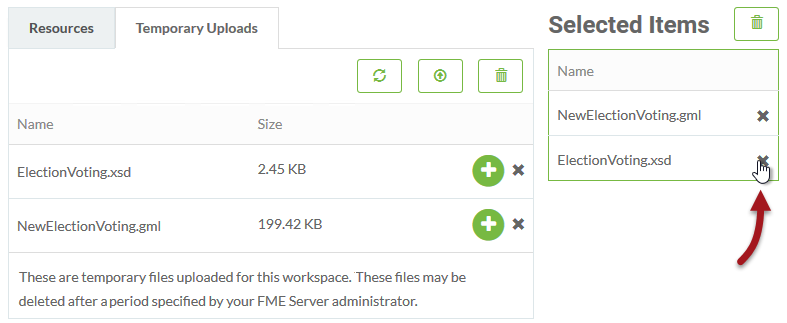

<!--Exercise Section-->

<table style="border-spacing: 0px;border-collapse: collapse;font-family:serif">
<tr>
<td width=25% style="vertical-align:middle;background-color:darkorange;border: 2px solid darkorange">
<i class="fa fa-cogs fa-lg fa-pull-left fa-fw" style="color:white;padding-right: 12px;vertical-align:text-top"></i>
Exercise 4
</td>
<td style="border: 2px solid darkorange;background-color:darkorange;color:white">
Daily Database Updates: Publishing Data
</td>
</tr>

<tr>
<td style="border: 1px solid darkorange; font-weight: bold">Data</td>
<td style="border: 1px solid darkorange">Firehalls (GML) Neighborhoods (KML) Election Voting (GML)</td>
</tr>

<tr>
<td style="border: 1px solid darkorange; font-weight: bold">Overall Goal</td>
<td style="border: 1px solid darkorange">Create a workspace to read and process departmental data and publish it to FME Server</td>
</tr>

<tr>
<td style="border: 1px solid darkorange; font-weight: bold">Demonstrates</td>
<td style="border: 1px solid darkorange">Publishing source data and uploading temporary datasets</td>
</tr>

<tr>
<td style="border: 1px solid darkorange; font-weight: bold">Start Workspace</td>
<td style="border: 1px solid darkorange">C:\FMEData2017\Workspaces\ServerAuthoring\Basics-Ex4-Begin.fmw</td>
</tr>

<tr>
<td style="border: 1px solid darkorange; font-weight: bold">End Workspace</td>
<td style="border: 1px solid darkorange">C:\FMEData2017\Workspaces\ServerAuthoring\Basics-Ex4-Complete.fmw</td>
</tr>

</table>

---

For the exercises in this chapter, you are a technical analyst in the GIS department of your local city. 

You have already (Exercises 1, 2, and 3) created a workspace to carry out a translation, published it to FME Server, ran it to confirm it works, shared the repository, and set the workspace to run on a schedule.

Now you have a task to create a new workspace. One of the datasets it uses is the same as in the previous exercise, so we will try to have this second workspace use the data belonging to the first.

---

<!--Person X Says Section-->

<table style="border-spacing: 0px">
<tr>
<td style="vertical-align:middle;background-color:darkorange;border: 2px solid darkorange">
<i class="fa fa-quote-left fa-lg fa-pull-left fa-fw" style="color:white;padding-right: 12px;vertical-align:text-top"></i>
Sister Intuitive says...
</td>
</tr>

<tr>
<td style="border: 1px solid darkorange">

If you have lots of experience with FME Workbench - <strong>and if your instructor agrees</strong> - simply open the workspace listed in the header above and skip to step 7

</td>
</tr>
</table>

---

 **1) Inspect Source Data**
 The first task in any new project is to inspect the source data, so let's do that. Use the FME Data Inspector to open these two datasets:

<table style="border: 0px">

<tr>
<td style="font-weight: bold">Reader Format</td>
<td style="">GML (Geography Markup Language)</td>
</tr>

<tr>
<td style="font-weight: bold">Reader Dataset</td>
<td style="">C:\FMEData2017\Data\Elections\ElectionVoting.gml</td>
</tr>

</table>

You can turn off the layer of VotingDivisions. All we are interested in for this exercise are the point features designated as VotingPlaces:

 Map tiles by <a href="http://stamen.com">Stamen Design</a>, under <a href="http://creativecommons.org/licenses/by/3.0">CC-BY-3.0</a>. Data by <a href="http://openstreetmap.org">OpenStreetMap</a>, under <a href="http://creativecommons.org/licenses/by-sa/3.0">CC-BY-SA</a>.

 **2) Create Workspace**
 Open the starting workspace listed above. 

You might notice that it's a copy of our previous project, since the requirements for this workspace as so similar. If you do choose to just carry on working in that workspace, be sure to save it under a different name - otherwise the data we will publish will not work for this exercise.

The workspace looks like this:

 **3) Remove Firehalls**
 For this project we need to process election data instead of firehalls, so firstly delete the writer feature type for the firehalls, and then the reader feature type.

When you delete the reader feature type, you will be asked if you wish to delete the entire reader. We could reuse it but, for the sake of simplicity, click yes.

The workspace now looks like this:

 **4) Add VotingPlaces**
 Now select Readers &gt; Add Reader to start adding a reader to the workspace. When prompted, enter the following details for the VotingPlaces data:

<table style="border: 0px">

<tr>
<td style="font-weight: bold">Reader Format</td>
<td style="">GML (Geography Markup Language)</td>
</tr>

<tr>
<td style="font-weight: bold">Reader Dataset</td>
<td style="">C:\FMEData2017\Data\Elections\ElectionVoting.gml</td>
</tr>

</table>

Click OK to add the Reader to the workspace. When prompted only select the VotingPlaces feature type, not VotingDivisions:

 **5) Add VotingPlaces to Writer**
 To add VotingPlaces to the writer, right-click the newly placed reader feature type and choose Duplicate on 'NULL':

There will now be a reader and writer feature type for the VotingPlaces dataset:

Change the connections to pass the VotingPlaces data through the Clipper transformer just as the FireHalls used to be:

 **6) Set VotingPlaces Feature Type Name**
 Finally, as with the FireHalls, let's set the Feature Type Name for the VotingPlaces writer feature type.

Inspect its parameters and under Feature Type Name either enter:

<pre>
VotingPlaces-@Value(NeighborhoodName)
</pre>

...or click the dropdown and use the text editor dialog to enter that value. This will cause voting places in each different neighborhood to be written to a different table/layer.

Save the workspace. As already mentioned, make sure it has a different name to the first project.

 **7) Publish to Server**
 Publish the workspace to FME Server. This time you can simply choose the previously created FME Server connection, rather than having to enter parameters all over again.

For the repository select the previously created Training repository and enter a name for the workspace if it doesn't already have one. 

This time, instead of simply checking the box to upload all the data files, click the Select Files button:

This dialog lists the files we are about to publish to the repository with the workspace. Technically the VancouverNeighborhoods dataset was already published to the repository with the previous workspace, but it's not very good practice to try and re-use data this way (even though we could) so place a check mark against all files and click OK:

In the final dialog of the publishing wizard, once again choose the Job Submitter as the web service to register the workspace against.

 **8) Examine Files**
 If you have access to the FME Server computer itself, open a file browser and browse to the location that repository data is stored. Here it is C:\ProgramData\Safe Software\FME Server\repositories\Training:

You'll see that each workspace is saved to a separate folder. If you inspect the contents of a folder you'll see the uploaded datasets within it.

This is how a workspace has access to files published with it. It can also, with some manual effort, access files stored with another workspace in the same repository.

 **9) Run Workspace**
 Locate and run the workspace. In the Run dialog notice that the published parameters denoting the source data include an FME environment variable, FME_MF_DIR:

This variable tells FME to look in the same folder as the workspace for the source data files. As you can see, it isn't particularly user friendly to handle data in this way, even though the workspace will run just fine.

 **9) Upload Temporary Data**
 Now let's pretend that the layer of VotingPlaces data has changed in some way. You can simulate that by simply opening a file browser and making a copy of the GML file.

For example, rename C:\FMEData2017\Data\Elections\ElectionVoting.gml to NewElectionVoting.gml

***NB:** You don't also have to copy ElectionVoting.xsd - it's fine to use that schema file for the new GML dataset.*

Now, in the FME Server web interface, log out of the admin account and log in as a user (user/user).

So, as a user we wish to run the workspace with the new data. We can't publish the data because the user account doesn't have permission to write to that repository; and in any case, since the workspace hasn't changed in any way, we shouldn't have to go through the publish process.

So, click Run Workspace and select the newly published workspace in the Training repository. However, to use the new dataset, click the browse button to the right of the Source GML prompt:

In the dialog that opens, click the Temporary Uploads tab and then on the Upload File button:

Select both the files NewElectionVoting.gml and ElectionVoting.xsd and click Open to upload them. Now - back in the prior dialog - click the X button to deselect the xsd file:

The file needs to exist, but it doesn't need to be selected. Now click OK and then click the Run button.

The workspace will now run to completion using the uploaded dataset. 

However - and this is the important part - this was only a temporary upload. The workspace can be re-run immediately and the data will still appear in the temporary upload section, but it is not a permanent solution. The data is likely to be cleaned up automatically within 24 hours. 

---

<!--Exercise Congratulations Section--> 

<table style="border-spacing: 0px">
<tr>
<td style="vertical-align:middle;background-color:darkorange;border: 2px solid darkorange">
<i class="fa fa-thumbs-o-up fa-lg fa-pull-left fa-fw" style="color:white;padding-right: 12px;vertical-align:text-top"></i>
CONGRATULATIONS
</td>
</tr>

<tr>
<td style="border: 1px solid darkorange">

By completing this exercise you have learned how to:
 
<ul><li>Update a workspace with a new reader and a new writer feature type</li>
<li>Publish a workspace to FME Server and include source data</li>
<li>Locate source data on the FME Server filesystem</li>
<li>Select a source dataset to upload temporarily at run-time</li>

</td>
</tr>
</table>