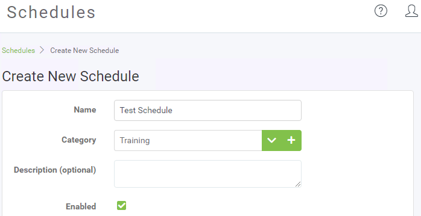
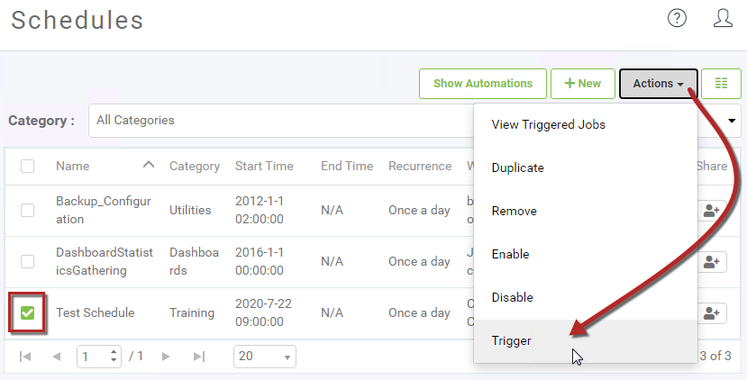

<!--Exercise Section-->

<table style="border-spacing: 0px;border-collapse: collapse;font-family:serif">
<tr>
<td width=25% style="vertical-align:middle;background-color:darkorange;border: 2px solid darkorange">
<i class="fa fa-cogs fa-lg fa-pull-left fa-fw" style="color:white;padding-right: 12px;vertical-align:text-top"></i>
Exercise 1.4
</td>
<td style="border: 2px solid darkorange;background-color:darkorange;color:white">
Daily Database Updates: Workspace Scheduling
</td>
</tr>

<tr>
<td style="border: 1px solid darkorange; font-weight: bold">Data</td>
<td style="border: 1px solid darkorange">Firehalls (GML) Neighborhoods (KML)</td>
</tr>

<tr>
<td style="border: 1px solid darkorange; font-weight: bold">Overall Goal</td>
<td style="border: 1px solid darkorange">Create a workspace to read and process departmental data and publish it to FME Server</td>
</tr>

<tr>
<td style="border: 1px solid darkorange; font-weight: bold">Demonstrates</td>
<td style="border: 1px solid darkorange">Schedule a workspace to run automatically on FME Server </td>
</tr>

<tr>
<td style="border: 1px solid darkorange; font-weight: bold">Start Workspace</td>
<td style="border: 1px solid darkorange">None</td>
</tr>

<tr>
<td style="border: 1px solid darkorange; font-weight: bold">End Workspace</td>
<td style="border: 1px solid darkorange">None</td>
</tr>

</table>

---

You have already (in Exercises 1, 2, and 3) created a workspace to carry out this translation, published it to FME Server, run it to confirm it works, and committed it to version history.

As a daily task, you plan to run the translation every day after work. However... what happens if you are not there or leave early? How can you make sure it runs every day at the same time then?

This is where Scheduling comes in handy. You can set up the workspace to run on an automatic schedule so you don't have to remember to run it daily.

 **1) Connect to Server**
 Browse to the login page of the FME Server interface, and log in using the administrator account (admin/admin).

 **2) Create Test Schedule**
 Firstly, just to confirm that scheduling does work, let's set up a test schedule. Click Schedules on the menu and, in the Schedules page, click the New button to start the process.

Set a name of Test Schedule and add it to a Training category by typing Training into the Category field:

For the time settings, set the schedule to start immediately and run every 30 seconds. Uncheck the box beside Does Not Expire and set the end time to be approximately 30 minutes into the future (that way if we forget to cancel the schedule it won't carry on forever!)

Be aware that the times are given in 24-hour format, so 1:30 means AM and 13:30 means PM. It is also important to note that this time is the local time of the machine on which you are running the web browser that is connected to FME Server. Keep this in mind if your FME Server is on a machine in a different time zone from the machine where you are accessing FME Server.

Under Workspace Settings, select the Training repository and within that the workspace previously uploaded (Basics-Ex1-Complete.fmw):

There are no user parameters we need to change for this workspace, so any can be ignored.

Now click OK to add the new schedule.

 **5) Examine Jobs Page**
 Open the Jobs page. A list of previously run jobs will open. You will find (if it was set up correctly) that there will be jobs running to schedule:

Notice that the username is set to admin; since that is the user who created the schedule, that is the username under which the job will be run.

 **6) Create Actual Schedule**
 Now we are confident that we know how to use the interface, let's set up an actual schedule. We want the workspace to run, say, every day of the week. There should also be no end date.

So, return to the Schedules page. You may now either:

- Click on the Test schedule and edit it to the required values
- Delete the test schedule and create a new one with the required values

Once you click OK, this setup will run the workspace at 8:00pm every day. I'm not sure about you, but I don't think we should stick around until then to check this Schedule ran correctly!

Return to the Schedule home page, select the Training schedule we just created and notice the Trigger button is no longer greyed out. We can use this to trigger a one-off run and confirm the schedule was configured correctly.

You may wish to check back periodically during this training to ensure the workspace runs as expected.

---

<!--Exercise Congratulations Section-->

<table style="border-spacing: 0px">
<tr>
<td style="vertical-align:middle;background-color:darkorange;border: 2px solid darkorange">
<i class="fa fa-thumbs-o-up fa-lg fa-pull-left fa-fw" style="color:white;padding-right: 12px;vertical-align:text-top"></i>
CONGRATULATIONS
</td>
</tr>

<tr>
<td style="border: 1px solid darkorange">

By completing this exercise you have learned how to:
 
<ul><li>Schedule a translation in FME Server</li>
<li>Check the job history to ensure the scheduled translation took place</li></ul>

</td>
</tr>
</table>
