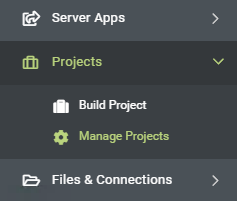
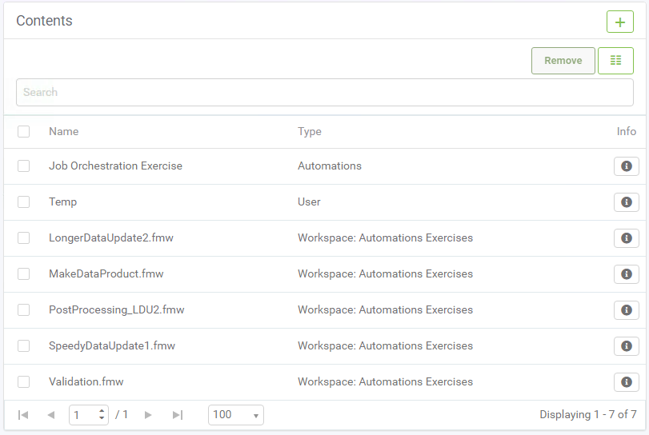
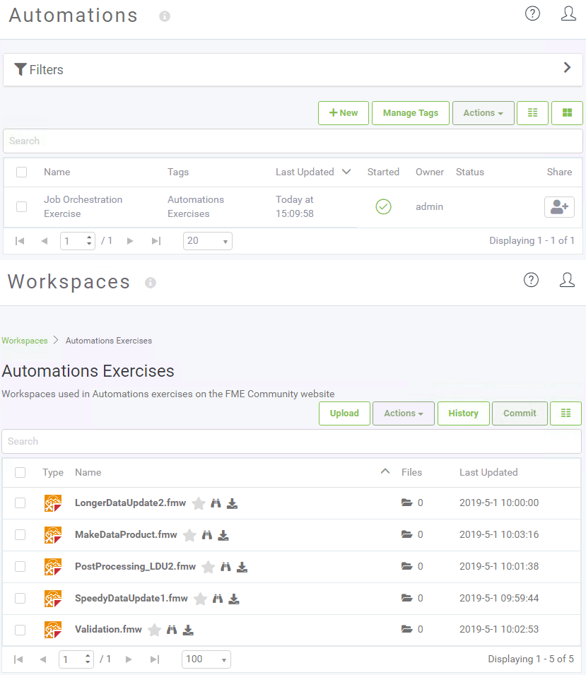
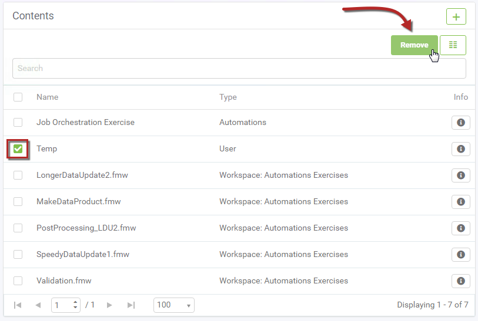
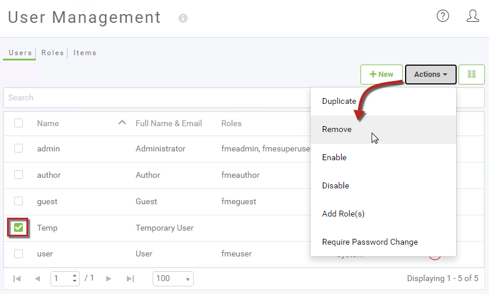

<!--Instructor Notes-->

<!--Exercise Section-->

<table style="border-spacing: 0px;border-collapse: collapse;font-family:serif">
<tr>
<td width=25% style="vertical-align:middle;background-color:darkorange;border: 2px solid darkorange">
<i class="fa fa-cogs fa-lg fa-pull-left fa-fw" style="color:white;padding-right: 12px;vertical-align:text-top"></i>
Exercise 1.7
</td>
<td style="border: 2px solid darkorange;background-color:darkorange;color:white">
Best Practice Workspace Analysis Project
</td>
</tr>

<tr>
<td style="border: 1px solid darkorange; font-weight: bold">Data</td>
<td style="border: 1px solid darkorange">Workspace Files</td>
</tr>

<tr>
<td style="border: 1px solid darkorange; font-weight: bold">Overall Goal</td>
<td style="border: 1px solid darkorange">Import an FME Server Project</td>
</tr>

<tr>
<td style="border: 1px solid darkorange; font-weight: bold">Demonstrates</td>
<td style="border: 1px solid darkorange">FME Server Projects</td>
</tr>

<tr>
<td style="border: 1px solid darkorange; font-weight: bold">Start Workspace</td>
<td style="border: 1px solid darkorange">N/A</td>
</tr>

<tr>
<td style="border: 1px solid darkorange; font-weight: bold">End Workspace</td>
<td style="border: 1px solid darkorange">N/A</td>
</tr>

<tr>
<td style="border: 1px solid darkorange; font-weight: bold">Start Project</td>
<td style="border: 1px solid darkorange">C:\FMEData2020\Projects\ServerAuthoring\Ch1-Ex7-JobOrchestrationProject.fsproject</td>
</tr>

</table>

---

Job orchestration is an FME Server Automations concept. It allows for two or more parallel workflows with different processing times to run simultaneously, then the next action will wait until everything prior is completed, then proceed as one unified process. Automations will be covered in detail in Chapter 4; for now, we are just going to look at how to import a project a colleague has shared with us.

---

 **1) Browse To Projects**
 Open the FME Server web interface and log in with an account that has administrator privileges.

Expand Projects on the side menu and then go to the Manage Projects page:

 **2) Import Project**
 Click on the Import button to open the Import page:

We can accept the default Import parameters. Click Upload File and then browse to the following location:

<pre>
C:\FMEData2020\Projects\ServerAuthoring\Ch1-Ex7-JobOrchestrationProject.fsproject
</pre>

Click Import and the project will quickly be imported:

 **3) Check Log**
 Click the View Details button to examine the Project Import log. A successful import will look something like this:

---

<!--Tip Section-->

<table style="border-spacing: 0px">
<tr>
<td style="vertical-align:middle;background-color:darkorange;border: 2px solid darkorange">
<i class="fa fa-info-circle fa-lg fa-pull-left fa-fw" style="color:white;padding-right: 12px;vertical-align:text-top"></i>
TIP
</td>
</tr>

<tr>
<td style="border: 1px solid darkorange">

The history page under projects will show a full history of all projects that have been imported to the system.

</td>
</tr>
</table>

---

 **4) Check Components**
 Now let's check for some of the components that should have been imported.

Click Manage Projects on the menu again, and click on AutomationsJobOrchestraion-Complete. You should now see a list of the imported contents:

Use the menu options to check the Automation and workspaces to ensure that the imported components do exist:

 **5) Clean Up Project**
 One part of the project that is not needed is a user account.

So, return to the project contents, select the Temp User, and remove it.

This will remove the account from the project, but since the project has already been imported, the account will also exist on the machine. So also go to the User Management > Users page and remove the Temp user:

You will be prompted to which user account to transfer the ownership of items that were created with the Temp user account. Select admin and then click OK:

 **6) Export Project**
 Now the project has been updated, export it so that it can be imported in its proper form elsewhere.

To do so, browse to the Manage Projects page, select the project (using the checkbox on the left), and click the Export button.

In the dialog that opens, you can choose whether to save the project file to a download or a resources folder. Once complete the following message will appear:

---

<!--Exercise Congratulations Section-->

<table style="border-spacing: 0px">
<tr>
<td style="vertical-align:middle;background-color:darkorange;border: 2px solid darkorange">
<i class="fa fa-thumbs-o-up fa-lg fa-pull-left fa-fw" style="color:white;padding-right: 12px;vertical-align:text-top"></i>
CONGRATULATIONS
</td>
</tr>

<tr>
<td style="border: 1px solid darkorange">

By completing this exercise you have learned how to:
 
<ul><li>Import a Project</li>
<li>Check the Project History and confirm a Project was successfully imported</li>
<li>Edit a Project's contents</li>
<li>Remove a user</li>
<li>Export a Project</li></ul>

</td>
</tr>
</table>
