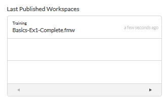
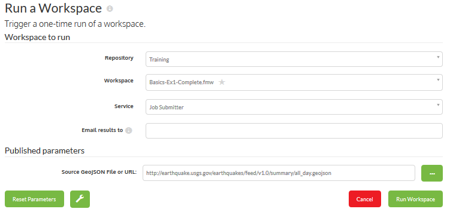

<!--Instructor Notes-->
<!--This exercise uses a basic amount of FME Workbench as a test for students-->
<!--If students have problems now, it is unlikely they will have much success at further exercises-->

<!--Exercise Section-->
<!--NB: In GitBook world we don't give a number to exercises-->

<table style="border-spacing: 0px;border-collapse: collapse;font-family:serif">
<tr>
<td width=25% style="vertical-align:middle;background-color:darkorange;border: 2px solid darkorange">
<i class="fa fa-cogs fa-lg fa-pull-left fa-fw" style="color:white;padding-right: 12px;vertical-align:text-top"></i>
Exercise2 
</td>
<td style="border: 2px solid darkorange;background-color:darkorange;color:white">
Earthquake Processing
</td>
</tr>

<tr>
<td style="border: 1px solid darkorange; font-weight: bold">Data</td>
<td style="border: 1px solid darkorange">Earthquakes (GeoJSON)</td>
</tr>

<tr>
<td style="border: 1px solid darkorange; font-weight: bold">Overall Goal</td>
<td style="border: 1px solid darkorange">Create a workspace to read and process earthquake data and publish it to FME Server</td>
</tr>

<tr>
<td style="border: 1px solid darkorange; font-weight: bold">Demonstrates</td>
<td style="border: 1px solid darkorange">Examining the FME Server interface and running a workspace</td>
</tr>

<tr>
<td style="border: 1px solid darkorange; font-weight: bold">Start Workspace</td>
<td style="border: 1px solid darkorange">N/A</td>
</tr>

<tr>
<td style="border: 1px solid darkorange; font-weight: bold">End Workspace</td>
<td style="border: 1px solid darkorange">N/A</td>
</tr>

</table>

---

You're a technical analyst in the GIS department of your local city. You have plenty of experience using FME Desktop, and your department is now investigating FME Server to evaluate its capabilities.

After creating a workspace to read a feed of earthquake data, and publishing it to FME Server, you now wish to log in to Server to run that workspace. 

 **1) Connect to Server**
 To log in to the server interface either select the Web User Interface option from the start menu or - in your web browser - enter the address to your FME Server.

---

<table style="border-spacing: 0px">
<tr>
<td style="vertical-align:middle;background-color:darkorange;border: 2px solid darkorange">
<i class="fa fa-info-circle fa-lg fa-pull-left fa-fw" style="color:white;padding-right: 12px;vertical-align:text-top"></i>
TIP
</td>
</tr>

<tr>
<td style="border: 1px solid darkorange">

When FME Server is installed on either physical or virtual hardware, the address is http://&lt;servername&gt;/fmeserver
  If you are using FME Cloud, then the address is: http://&lt;server name&gt;.fmecloud.com/fmeserver

</td>
</tr>
</table>

---

This will open the web user interface login screen for the FME Server being used. Bookmark this web address, since you will use this link quite often.

 **2) Log In to Server**
 In the User Login dialog, enter a username and password for your FME Server account. A common username/password combination for a training installation is admin/admin

Click the Login button.

Check engines

 **12) Select Workspace**
 Examine the user interface. This is your primary method for interacting with FME Server. Notice that your workspace will be listed under Last Published Workspaces:

Click on this entry to open the web page for this workspace.

 **13) Run Workspace**
 The workspace page shows very few options, because this workspace did not have many published parameters:

So, simply click the Run button to run the workspace. The workspace will run to completion.

 **14) Examine Jobs Page**
 Click Manage &gt; Jobs on the menu. A list of previously run jobs will open, including the one we just ran:

Click on your job to inspect the results in more detail. You will be able to see the job ID number; the different times at which it was submitted, queued, and run; the exact request made to FME Server; and the full results of the translation. You may also click the View Log button to inspect the FME translation log file.

---

<!--Person X Says Section-->

<table style="border-spacing: 0px">
<tr>
<td style="vertical-align:middle;background-color:darkorange;border: 2px solid darkorange">
<i class="fa fa-quote-left fa-lg fa-pull-left fa-fw" style="color:white;padding-right: 12px;vertical-align:text-top"></i>
Miss Vector says...
</td>
</tr>

<tr>
<td style="border: 1px solid darkorange">

Remember, this workspace did not write any data, only sent it to the Logger. So, for now, to view any results search for them in the log file.

</td>
</tr>
</table>

---

Check resources

Check cleanup tools

---

<!--Advanced Exercise Section-->

<table style="border-spacing: 0px">
<tr>
<td style="vertical-align:middle;background-color:darkorange;border: 2px solid darkorange">
<i class="fa fa-cogs fa-lg fa-pull-left fa-fw" style="color:white;padding-right: 12px;vertical-align:text-top"></i>
Advanced Exercise
</td>
</tr>

<tr>
<td style="border: 1px solid darkorange">

Were you logged in an an administrator when you created the training repository? If so, maybe we should check the security settings for that?

</td>
</tr>
</table>

---

**Advanced Task**

 **14) Examine Jobs Page**
 Click Manage &gt; Administration &gt; Security on the FME Server web interface menu. This will open the security parameters dialog (assuming your account has permission to do so).

Click on the Object Policies tab:

Locate the Training repository in the list of security objects. You should see that the roles allowed to make use of it is restricted to the one(s) to which the publisher's account belongs.

If you were an administrator, then this repository will be associated only with the fmeadmin role; therefore only an administrator will be able to make use of that repository.

Click on the repository object to open its security policies. Click on the drop-down list of roles and add all other roles so that users with a user, author, or guest account can access this repository.

Click OK to accept the changes.

