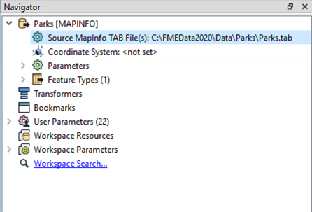
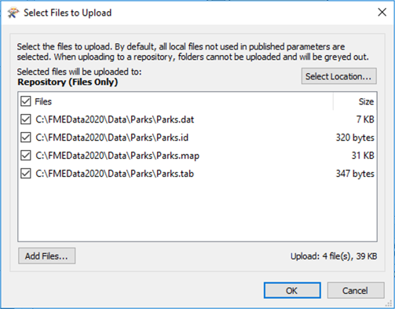

## Publishing File Datasets to a Repository ##

When the source data for a translation is stored as files (rather than a feed or database), it is possible to publish data to an FME Server repository along with the workspace. This data upload method  fast and simple, but limits future access to the data. A better practice is to publish your data to the Resources folder separate from the workspace, but we'll walk through those steps in a later exercise. 

---

### Publishing Source Data ###

In this workspace the source dataset is MapInfo TAB:

A MapInfo TAB dataset is made up of a series of files (.tab, .dat, .id, .map). When this workspace is published the wizard allows us to publish the data files alongside it by simply checking the box labeled *Upload data files*.

FME automatically selects the files to upload based on what it thinks is necessary to run the translation. If there are other files you wish to upload, or files FME selected that you don't wish to upload, the Select Files button allows you to make changes:

This dialog also allows you to change *where* the files are published to, but for now we'll ignore that setting and go with the default of publishing to the repository.

Once the publishing wizard is complete, those files are uploaded to FME Server and tagged for use with this workspace.

---

### Using Published Source Data ###

When a workspace published with its data is run on FME Server, the uploaded data automatically is used as the source:

There are no other settings that need to be changed, and the workspace will run to completion using the published data as its source.
