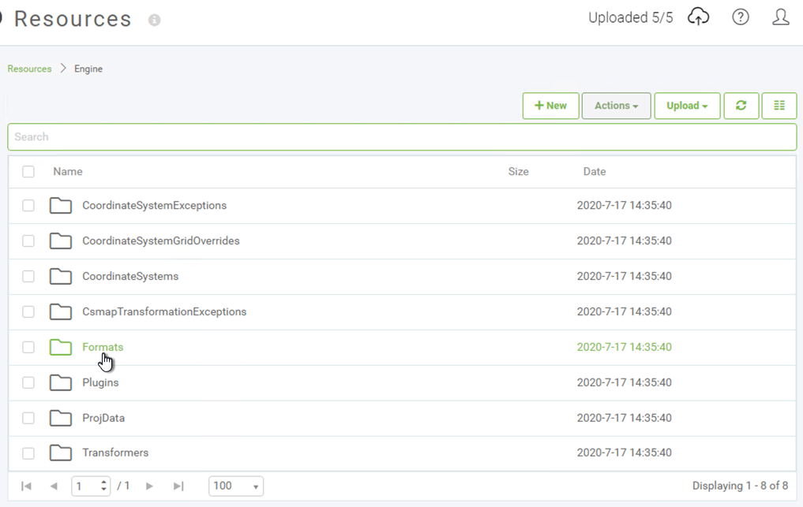
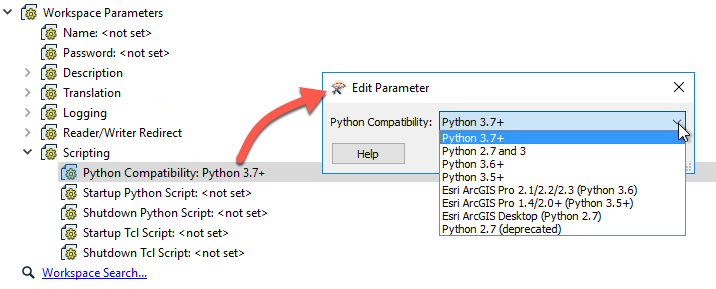

## Sharing Custom Resources with FME Engine##

As an FME Author you may create workspaces that require additional references to files not installed with FME as part of the standard library, in which case these files need to be uploaded to FME Server in a specific location for the FME Engine to have access to these. This process is separate from pushing up source datasets and may require involvement from your FME Server Administrator.

### Sharing Custom Formats and Transformers ###

There are three ways to upload custom Formats and Transformers to FME Server:
1. Upload the .fmx file to Resources in the FME Server Web UI under the appropriate subdirectory in the Engine folder. This will make the format or transformer accessible to all workspaces on FME Server.

2. Publish the custom format/transformer .fmx file to FME Server by opening the .fmx in FME Workbench like you would a .fmw and using the File > Publish to FME Server option. Using this method it will be available to all Workspaces stored in the same repository that it is published to.
3. Publish when publishing a workspace by adding the .fmx as a file to Upload in the publishing wizard. Specifying either to upload to Repository (2) or to a shared resource folder (1) depending on who you would like to give access to this format.

### Using Python with FME Server ###

When using Python with FME Server, there are two possible scenarios an FME author should be aware of that may prevent the workspace from running as expected:

1. If you run workspaces that reference python from FME Server, the FME Engines must know which Python interpreter to use. The Python interpreter that the FME Engines use is the one that most closely matches the Python Compatibility workspace parameter set in the Navigator.

2. When Using Additional Python Modules not shipped as a part of the standard library it is necessary to upload the Python modules to FME Server Resources under Engine > Plugins > Python.

### Using R with FME Server ###

Similar to using R with FME Workbench, there are some additional steps needed to execute R scripts in a workspace running on FME Server:

1. Install R
2. Install the sqldf package for R
3. Upload the package libraries to FME Server under Resources > Engine > Plugins > R

Steps 1 and 2 must be performed on all machines that run FME Engines.
