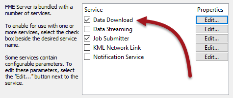
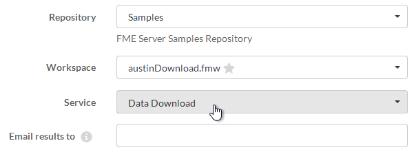
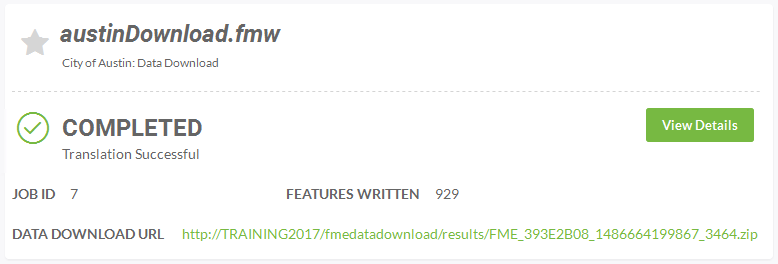

# Implementing Self Serve

Implementing a self-serve system makes use of the appropriate services available on FME Server.

## Creating Data Download Services ##

Creating and using a data download service is very easy. A workspace becomes available for data download use when the author registers it against the Data Download service when publishing it to FME Server:

Once registered this way, Data Download becomes an acceptable way to run this workspace. This might be run in a number of ways, one of which is selecting Data Download as the service in the FME Server Web interface:

The results of the workspace are not written to a specific output location; instead they are delivered to the user in the form of a hyperlink to a zipped dataset:

---

## Creating Data Upload Services

A Data Upload service is different in that a workspace is not registered specifically to this utility service. Instead, publishing source dataset parameters in the workspace allows data upload to take place. 

On FME Server there are two ways to upload data, depending on the requirements for the data. There is a specific Data Upload Service and there is also the Resources filesystem.

The Data Upload Service uploads data to a particular workspace in a particular repository. The data is held temporarily for the workspace to be run.

---

<!--Person X Says Section-->

<table style="border-spacing: 0px">
<tr>
<td style="vertical-align:middle;background-color:darkorange;border: 2px solid darkorange">
<i class="fa fa-quote-left fa-lg fa-pull-left fa-fw" style="color:white;padding-right: 12px;vertical-align:text-top"></i>
Professor Spatial F.M.E., E.T.L. says...
</td>
</tr>

<tr>
<td style="border: 1px solid darkorange">

You will have already met the Data Upload service: It's what is used when data is published to a repository alongside a workspace in the Workbench FME Server Publishing Wizard.

</td>
</tr>
</table>

---

The Resources filesystem allows data to be uploaded to a folder for use by any workspace in any repository. This upload is persistent and the data held there for as long as it required.

When creating a customized solution that involves data upload, the developer can choose whether to use to Data Upload service or whether to use the Resources filesystem instead. The main difference is whether the data needs to reside on the Server permanently or just temporarily.

---

<!--Person X Says Section-->

<table style="border-spacing: 0px">
<tr>
<td style="vertical-align:middle;background-color:darkorange;border: 2px solid darkorange">
<i class="fa fa-quote-left fa-lg fa-pull-left fa-fw" style="color:white;padding-right: 12px;vertical-align:text-top"></i>
Miss Vector says...
</td>
</tr>

<tr>
<td style="border: 1px solid darkorange">

When a workspace is registered against the Data Download service (and no other), how can you run it? Select all that apply.
  <a href="http://52.73.3.37/fmedatastreaming/Manual/QAResponse2017.fmw?chapter=22&question=3&answer=1&DestDataset_TEXTLINE=C%3A%5CFMEOutput%5CQAResponse.html">1. With the FMEServerJobSubmitter transformer</a>
 <a href="http://52.73.3.37/fmedatastreaming/Manual/QAResponse2017.fmw?chapter=22&question=3&answer=2&DestDataset_TEXTLINE=C%3A%5CFMEOutput%5CQAResponse.html">2. With the run dialog in the web interface</a>
 <a href="http://52.73.3.37/fmedatastreaming/Manual/QAResponse2017.fmw?chapter=22&question=3&answer=3&DestDataset_TEXTLINE=C%3A%5CFMEOutput%5CQAResponse.html">3. With the URL specified under Developer Information in the run dialog</a>
 <a href="http://52.73.3.37/fmedatastreaming/Manual/QAResponse2017.fmw?chapter=22&question=3&answer=4&DestDataset_TEXTLINE=C%3A%5CFMEOutput%5CQAResponse.html">4. By setting it to run under a schedule</a>

</td>
</tr>
</table>
