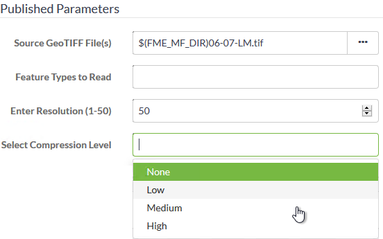

<!--Instructor Notes-->

<!--Exercise Section-->

<table style="border-spacing: 0px;border-collapse: collapse;font-family:serif">
<tr>
<td width=25% style="vertical-align:middle;background-color:darkorange;border: 2px solid darkorange">
<i class="fa fa-cogs fa-lg fa-pull-left fa-fw" style="color:white;padding-right: 12px;vertical-align:text-top"></i>
Exercise 2
</td>
<td style="border: 2px solid darkorange;background-color:darkorange;color:white">
Data Download System: Published Parameters
</td>
</tr>

<tr>
<td style="border: 1px solid darkorange; font-weight: bold">Data</td>
<td style="border: 1px solid darkorange">Orthophoto images (GeoTIFF)</td>
</tr>

<tr>
<td style="border: 1px solid darkorange; font-weight: bold">Overall Goal</td>
<td style="border: 1px solid darkorange">Create an FME Server Data Download system for orthophotos</td>
</tr>

<tr>
<td style="border: 1px solid darkorange; font-weight: bold">Demonstrates</td>
<td style="border: 1px solid darkorange">Creating published parameters for user control in Data Download</td>
</tr>

<tr>
<td style="border: 1px solid darkorange; font-weight: bold">Start Workspace</td>
<td style="border: 1px solid darkorange">C:\FMEData2017\Workspaces\ServerAuthoring\SelfServe1-Ex2-Begin.fmw</td>
</tr>

<tr>
<td style="border: 1px solid darkorange; font-weight: bold">End Workspace</td>
<td style="border: 1px solid darkorange">C:\FMEData2017\Workspaces\ServerAuthoring\SelfServe1-Ex2-Complete.fmw</td>
</tr>

</table>

---

As a technical analyst in the GIS department of a city you have just commenced a project to allow other departments to download orthophoto data, rather than having to ask you to create it for them. Not only will their requests be processed quicker, you will also spend less time on that task.

So far you have created a simple workspace to translate orthophotos to jpeg format, and published it to a Data Download service on FME Server.

Now you need to start customizing the workspace to allow the end-users to have a degree of control over the output.

 **1) Open Workspace**
 Open the workspace from exercise 1, or the starting workspace listed above. You can see that it consists of a reader, a writer, and two transformers.

In this step we'll give the end-user control over the transformation stages.

 **2) Create User Parameter**
 If you look at the parameters for the RasterResampler transformer you'll see parameters for X Cell Spacing and Y Cell Spacing. We should let the end user choose what spacing they want.

So, in the Navigator window of FME Workbench, locate the section marked User Parameters. Right-click on there and choose the option Add Parameter: 

The dialog that opens allows us to create a new parameter. Create one using the following parameters:

<table>
<tr><td style="font-weight: bold">Type</td><td>Number</td></tr>
<tr><td style="font-weight: bold">Name</td><td>CellSpacing</td></tr>
<tr><td style="font-weight: bold">Published</td><td>Yes</td></tr>
<tr><td style="font-weight: bold">Optional</td><td>No</td></tr>
<tr><td style="font-weight: bold">Prompt</td><td>Enter Resolution (1-50)</td></tr>
<tr><td style="font-weight: bold">Configuration</td><td>Lower Limit: Greater than value: 0 Upper Limit: Less than value:51 Decimal places of precision: 0</td></tr>
<tr><td style="font-weight: bold">Default Value</td><td>50</td></tr>
</table>

Click OK to close the dialog.

 **3) Apply User Parameter**
 Currently we've created a user parameter, but not applied it to anywhere. 

Inspect the parameters for the RasterResampler transformer. Click the drop-down arrow to the right of the X Cell Spacing parameter, and choose User Parameter &gt; CellSpacing

Do the same for the Y Cell Spacing parameter. The dialog will now look like this:

Notice that we're using the same values for the X and Y cell sizes. That's OK. Although we could use rectangular (oblong) raster cells, for this exercise we'll stick with square.

 **4) Create User Parameter**
 Another setting we might give control of to the user is file compression. This is not defined in a transformer, but in the writer feature type. However, we can still create a published parameter in the same way.

So, right-click on User Parameters in the Navigator window and choose Add Parameter again.

This time we'll do this a little bit differently. Compression can be a value from zero to one hundred, but we'll present the user with the choice of None, Low, Medium, and High.

So create a parameter with the following:

<table>
<tr><td style="font-weight: bold">Type</td><td>Choice with Alias</td></tr>
<tr><td style="font-weight: bold">Name</td><td>Compression</td></tr>
<tr><td style="font-weight: bold">Published</td><td>Yes</td></tr>
<tr><td style="font-weight: bold">Optional</td><td>No</td></tr>
<tr><td style="font-weight: bold">Prompt</td><td>Select Compression Level</td></tr>
</table>

For the configuration field, click the [...] browse button. In the dialog that opens, set the following:

<table>
<tr><th>Display Name</th><th>Value</th></tr>
<tr><td>None</td><td>0</td></tr>
<tr><td>Low</td><td>25</td></tr>
<tr><td>Medium</td><td>50</td></tr>
<tr><td>High</td><td>75</td></tr>
</table>

Click OK and OK again to close these dialogs and create the parameter.

 **5) Apply User Parameter**
 To apply the parameter, inspect the parameters for the JPEG feature type. Expand the Compression parameters (if necessary) and set the Compression Level parameter to User Parameter &gt; Compression

Click OK to close the dialog. If you press the run button now - with the prompt option set - you'll see that there are now two new prompts for cell size and compression.

 **6) Publish and Run Workspace**
 Now publish the workspace to FME Server again. As before, register it with the Data Download service. 

Locate the workspace through the FME Server web interface and run it. This time you will be prompted to set the cell size and compression.

Run the workspace a few times, varying the cell size and compression, to confirm that the parameters are having an effect. The size of the output file is a good indicator that the process is working correctly.
 
---

<!--Exercise Congratulations Section--> 

<table style="border-spacing: 0px">
<tr>
<td style="vertical-align:middle;background-color:darkorange;border: 2px solid darkorange">
<i class="fa fa-thumbs-o-up fa-lg fa-pull-left fa-fw" style="color:white;padding-right: 12px;vertical-align:text-top"></i>
CONGRATULATIONS
</td>
</tr>

<tr>
<td style="border: 1px solid darkorange">

By completing this exercise you have learned how to:
 
<ul><li>Create an integer user parameter and apply it to two transformer parameters</li>
<li>Create a choice user parameter and apply it to a writer feature type parameter</li>
<li>Publish a workspace and use published parameters</li></ul>

</td>
</tr>
</table>   

