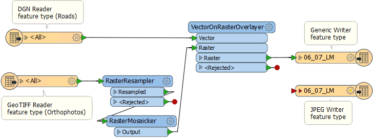
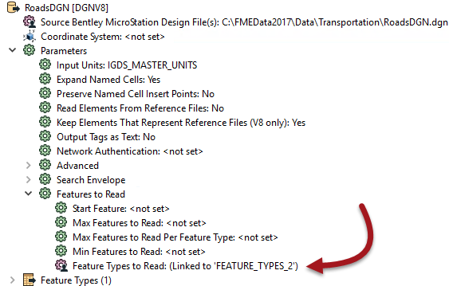
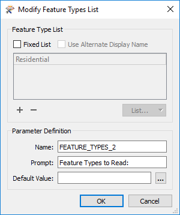
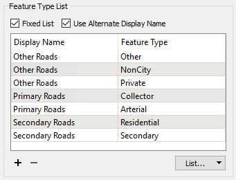
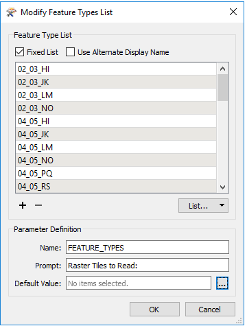
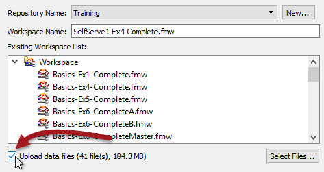
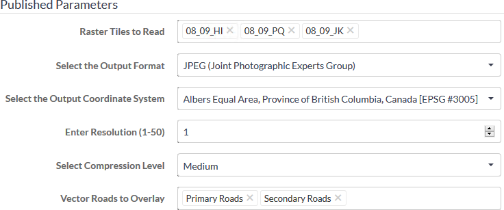

<!--Instructor Notes-->

<!--Exercise Section-->

<table style="border-spacing: 0px;border-collapse: collapse;font-family:serif">
<tr>
<td width=25% style="vertical-align:middle;background-color:darkorange;border: 2px solid darkorange">
<i class="fa fa-cogs fa-lg fa-pull-left fa-fw" style="color:white;padding-right: 12px;vertical-align:text-top"></i>
Exercise 4
</td>
<td style="border: 2px solid darkorange;background-color:darkorange;color:white">
Data Download System: Layer Selection
</td>
</tr>

<tr>
<td style="border: 1px solid darkorange; font-weight: bold">Data</td>
<td style="border: 1px solid darkorange">Orthophoto images (GeoTIFF)</td>
</tr>

<tr>
<td style="border: 1px solid darkorange; font-weight: bold">Overall Goal</td>
<td style="border: 1px solid darkorange">Create an FME Server Data Download system for orthophotos</td>
</tr>

<tr>
<td style="border: 1px solid darkorange; font-weight: bold">Demonstrates</td>
<td style="border: 1px solid darkorange">Adding vector data. Handling layer selection in Data Download</td>
</tr>

<tr>
<td style="border: 1px solid darkorange; font-weight: bold">Start Workspace</td>
<td style="border: 1px solid darkorange">C:\FMEData2017\Workspaces\ServerAuthoring\SelfServe-Ex4-Begin.fmw</td>
</tr>

<tr>
<td style="border: 1px solid darkorange; font-weight: bold">End Workspace</td>
<td style="border: 1px solid darkorange">C:\FMEData2017\Workspaces\ServerAuthoring\SelfServe-Ex4-Complete.fmw</td>
</tr>

</table>

---

As a technical analyst in the GIS department of a city you have just commenced a project to allow other departments to download orthophoto data, rather than having to ask you to create it for them. Not only will their requests be processed quicker, you will also spend less time on that task.

So far you have created a simple workspace to translate orthophotos to jpeg format. To this you have added published parameters for transformation, format, and coordinate system. The workspace was published it to a Data Download service on FME Server.

One of the frequent requests you get when you translate orthophoto data is to add vector data as an overlay on the raster. This is very simple in FME with the VectorOnRasterOverlayer transformer. However, to deploy this on FME Server means you need to give the end-users control over which vector layers are included.

 **1) Open Workspace**
 Open the workspace from exercise 3, or the begin workspace listed above. You can see that it consists of a reader, two writers, and two transformers, plus some published parameters.

To add - for example - road features to the raster output first requires a reader for those road features, so that is the first step...

 **2) Add Reader**
 Select Readers &gt; Add Reader and use the following setup:

<table style="border: 0px">

<tr>
<td style="font-weight: bold">Reader Format</td>
<td style="">Bentley MicroStation Design (V8)</td>
</tr>

<tr>
<td style="font-weight: bold">Reader Dataset</td>
<td style="">C:\FMEData2017\Data\Transportation\RoadsDGN.dgn</td>
</tr>

<tr>
<td style="font-weight: bold">Reader Parameters</td>
<td style="">Group Elements By: Level Names</td>
</tr>

<tr>
<td style="font-weight: bold">Workflow Options</td>
<td style="">Single Merged Feature Type</td>
</tr>

</table>

We'll use the Single Merged Feature Type option here because there are multiple source layers and yet - because they are being overlaid onto the raster as a group - we don't really need to have them divided in any way.

 **3) Add VectorOnRasterOverlayer Transformer**
 Add a VectorOnRasterOverlayer transformer. Connect the DGN feature type to the Vector input port, and the output of the RasterMosaicker transformer to the Raster input port:

You can check the parameters for this transformer but, for now at least, we'll leave them as they are.

 **4) Create User Parameter**
 Now we have some source data we can create a parameter to control which layers in that data should be read.

In the Navigator window find the DGN Reader's parameters, expand the Features to Read section, and locate the parameter called Feature Types to Read. You will see that it is already published - a result of us using the Single Merged Feature Type:

Right-click on the parameter and choose Edit User Parameter Definition. This will bring up a dialog that looks like this:

---

<!--Person X Says Section-->

<table style="border-spacing: 0px">
<tr>
<td style="vertical-align:middle;background-color:darkorange;border: 2px solid darkorange">
<i class="fa fa-quote-left fa-lg fa-pull-left fa-fw" style="color:white;padding-right: 12px;vertical-align:text-top"></i>
Professor Spatial F.M.E., E.T.L. says...
</td>
</tr>

<tr>
<td style="border: 1px solid darkorange">

The Feature Types to Read parameter tells FME which layers to read from the source. When you use a Single Merged Feature Type (or manually set a merge filter) it is published automatically. It also is set to update automatically.
  This means when the end-user is prompted to select feature types, FME will automatically scan the source dataset for the list. This is particularly useful for databases, where the table list will often change. However, for this project we're going to assume a fixed list of feature types. 

</td>
</tr>
</table>

---

 **5) Edit User Parameter**
 In the Modify Feature Types List dialog, check the box that is labelled Fixed List, and also the box that is labelled Use Alternate Display Name.

Click List &gt; Add From Current Dataset and - when prompted - select all of the feature types in this dataset. Click OK and the dialog will now look like this:

What we could do is just create a display name for each road type and close the dialog. The end-user will then be able to select any of the individual layers. However, for this project I think we should give them a simpler choice, and we will do that by grouping the layers.

So, under the Display Name, enter values to match as follows:

<table>
<tr><th>Display Name</th><th>Feature Type</th></tr>
<tr><td>Primary Roads</td><td>Arterial</td></tr>
<tr><td>Primary Roads</td><td>Collector</td></tr>
<tr><td>Other Roads</td><td>NonCity</td></tr>
<tr><td>Other Roads</td><td>Private</td></tr>
<tr><td>Secondary Roads</td><td>Residential</td></tr>
<tr><td>Secondary Roads</td><td>Secondary</td></tr>
<tr><td>Other Roads</td><td>Other</td></tr>
</table>

The list will sort itself by display name and look like this:

What this will do is give the user a choice of three options: Primary Roads, Secondary Roads, Other Roads. Whichever they choose will return all of the source layers for that choice.

One final task. In the lower part of the dialog, change the prompt to something like "Vector Roads to Overlay":

It's just a small thing but will help with the end user experience.

 **6) Save and Run Workspace**
 Save the workspace and then run it in FME Workbench to test it. You should be able to select any of the three types of roads, or even none of them.

Check that the output includes whatever roads you selected. 

 **7) Clean User Parameters**
 If your workspace is like mine, there are a number of extra published parameters we don't really need right now. Plus the order of parameters is not good. Let's take this opportunity to clean it up.

Locate and delete the following published parameters:

- SourceDataset_GEOTIFF
- SourceDataset_DGNV8
- DestDataset_JPEG
- DestDataset_GENERIC

Finally, let's change the order of parameters. You can do this by dragging one above the other in the Navigator window. So do this and put the parameters in the order that seems best to you:

 

 **8) Raster User Parameters**
 Now let's do something with the source raster. We want the user to be able to select the files to read, without having to upload them. Locate the reader in the Navigator window and double-click the Source GeoTIFF File(s) parameter. When prompted, select all of the GeoTIFF files in the Orthophotos folder.

This would normally mean that all files would get read into the translation; but the Feature Types to Read parameter will let the user actually choose which ones to read. We do, however, need to make some edits.

Open the definition of the GeoTIFF Feature Types to Read parameter. Click the option for a Fixed List. To list all of the available tiles select List &gt; Add From Current Dataset and select all the files.

Finally change the prompt to something sensible like "Raster Tiles to Read".

Now run the workspace again to check on our improved parameters dialog.

---

<!--Warning Section--> 

<table style="border-spacing: 0px">
<tr>
<td style="vertical-align:middle;background-color:darkorange;border: 2px solid darkorange">
<i class="fa fa-exclamation-triangle fa-lg fa-pull-left fa-fw" style="color:white;padding-right: 12px;vertical-align:text-top"></i>
WARNING
</td>
</tr>

<tr>
<td style="border: 1px solid darkorange">

At this point you might find, on running the workspace, that no filenames appear. Instead all you get is a single option called "Geotiff" in the file prompt.
  The reason for that is you made a mistake way back in exercise 1, step 1. You missed out setting the parameter "Feature Type Name(s)" to "From file name(s)".
  The only solution to this is to delete the GeoTIFF reader, and re-add it, this time being sure to set that parameter! Then you'll also have to clean up the reader's published parameters too.

</td>
</tr>
</table>

---

 **9) Publish to FME Server**
 Save the workspace and publish it to FME Server. There are two things to note.

Firstly, because we removed the Source Dataset parameters FME will suggest we upload the data. If your data is on the same computer as FME Server (or on a path otherwise accessible to the Server), then you don't need to do this and can uncheck that box:

If the files aren't accessible, then you will have to upload them all - but at least the end user will never have to.

Secondly, remember to make sure the Data Download service is using the "Output [GENERIC]" writer.

In the FME Server web interface, run the workspace, taking time to admire the new, cleaner set of parameters that are available:

Outside of a training environment we might want to order the raster tiles into groups, but we'll live with it as-is for now.

---

<!--Exercise Congratulations Section--> 

<table style="border-spacing: 0px">
<tr>
<td style="vertical-align:middle;background-color:darkorange;border: 2px solid darkorange">
<i class="fa fa-thumbs-o-up fa-lg fa-pull-left fa-fw" style="color:white;padding-right: 12px;vertical-align:text-top"></i>
CONGRATULATIONS
</td>
</tr>

<tr>
<td style="border: 1px solid darkorange">

By completing this exercise you have learned how to:
 
<ul><li>Add vector data onto raster</li>
<li>Use the Feature Types to Read parameter in automatic mode</li>
<li>Edit the Feature Types to Read parameter to create a manual list</li>
<li>Edit the Feature Types to Read parameter to create a grouped manual list</li>
<li>Clean up unnecessary user parameters and change the display order</li></ul>

</td>
</tr>
</table>   
