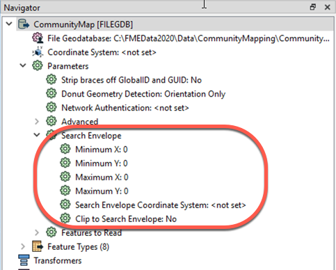
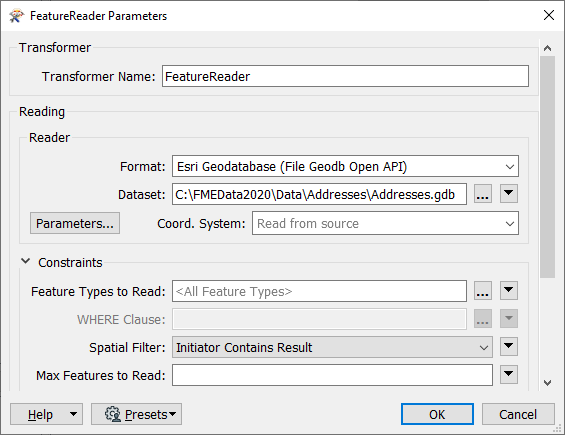

# Geographic Area of Interest #

Some self-serve workspaces benefit from letting the user choose to download data within a geographic area of interest. There are three ways of doing so with FME:

- A simple, rectangular bounding box
- An existing boundary (any area feature, such as a regional or municipal boundary)
- An ad-hoc boundary (an area drawn by the user as needed)

## Bounding Box ##

Letting the user define a bounding box is simple. Every reader can be restricted to only read features within a Search Envelope. The Minimum and Maximum X and Y parameters and the Search Envelope Coordinate System parameters can be published to give the user the ability to manually define a bounding box:

## Existing Boundary ##

You can give your readers the option to choose an existing boundary, like a county or a service area, and download the data within that area. There are several ways to accomplish this with FME, but the most effective is to use a WHERE Clause on the reader feature type combined with either a FeatureReader or a Clipper transformer.

### WHERE Clause

Many reader feature types have the option to apply an SQL WHERE clause to the data before reading it into the workspace. For example, this reader feature type has a WHERE clause that means only garbage zones in the blue zone and the north subzone will be read:

You can easily publish this WHERE Clause parameter to give users control over what existing boundary is used as the area of interest.

Even better, you could create specific user parameters that are then used within a WHERE clause that is already written. That way the use doesn't need to know how to write a WHERE clause.

For example, you might create one Choice or Choice (Multiple) parameter called Zone and one called Subzone and then include them in the WHERE Clause parameter through the WHERE Clause Builder:

### FeatureReader

Once you have setup a WHERE clause to let the user choose which boundaries to use, you then need to ensure they only receive their desired data within those boundaries. You can do this using a FeatureReader.

The polygon area of interest feature (or features) is routed into the FeatureReader Initiator port.

Here a single garbage schedule area (blue zone, north subzone) is passed to the FeatureReader for use as a filter. The idea is to return only addresses that fall inside that garbage collection zone. The parameters are set up like this:

Notice that the FeatureReader is set to read from an address geodatabase. The Spatial Filter parameter tells the transformer to only read features (addresses) inside the incoming polygon feature (garbage collection zone).

These features are output through a port dynamically added to the FeatureReader:

The feature counts here show that there are 955 addresses inside that garbage collection zone. The user can pick a zone and subzone and just receive the data from that area.

## Ad-hoc Boundary ##

---

<!--New Section-->

<table style="border-spacing: 0px">
<tr>
<td style="vertical-align:middle;background-color:darkorange;border: 2px solid darkorange">
<i class="fa fa-bolt fa-lg fa-pull-left fa-fw" style="color:white;padding-right: 12px;vertical-align:text-top"></i>
NEW
</td>
</tr>

<tr>
<td style="border: 1px solid darkorange">

FME 2020.0 introduces the Geometry parameter, a powerful new feature that lets FME Server users interactively define their geographic area of interest. The parameter accepts a polygon in GeoJSON format. To define it on Desktop, a user has to paste in GeoJSON. To define it on FME Server, they can interactively draw their area of interest on a web map.

</td>
</tr>
</table>

---

To let users interactively draw their own area of interest, you can use the Geometry user parameter. In this example, we want to create a workspace where the construction company can draw on a map where they will be working. Then a 100m buffer surrounding their construction area will be set and notify the residents of the neighboring houses.

We use a FeatureReader to read in the address points, and a Reprojector to put them into the UTM83-10 coordinate system. We create a Geometry published parameter that lets the user provide their area of interest. We then use that parameter to create geometry from GeoJSON using the GeometryReplacer. We use another Reprojector to make sure the area of interest matches the rest of the workspace. Then, we add a Bufferer to buffer 100m around the area of interest to capture addresses within the area affected by construction noise. After that, we use a Clipper to clip the source address data to the area of interest. At this point the features have quite a few attributes the construction company won't need, so we employ an AttributeKeeper to keep only the necessary attributes. Finally, we add an Excel writer feature type to create a spreadsheet that can be used by the construction company to notify affected addresses.

---

<!--Tip Section-->

<table style="border-spacing: 0px">
<tr>
<td style="vertical-align:middle;background-color:darkorange;border: 2px solid darkorange">
<i class="fa fa-info-circle fa-lg fa-pull-left fa-fw" style="color:white;padding-right: 12px;vertical-align:text-top"></i>
TIP
</td>
</tr>

<tr>
<td style="border: 1px solid darkorange">

Previous versions of FME can accomplish this, but they require using the FME Server REST API and HTML/CSS/Javascript. You can <a href="https://knowledge.safe.com/articles/1117/data-distribution-with-web-maps.html">view an example</a> on our Knowledge Base.

</td>
</tr>
</table>
