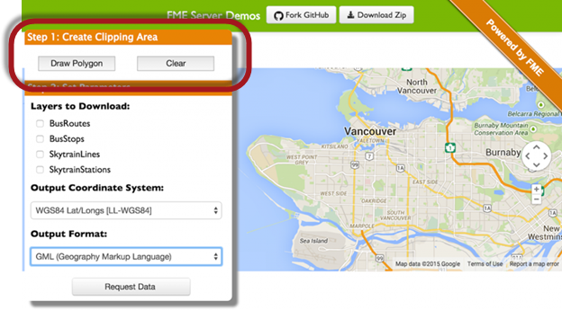

# Geographic Selection

Although most workspaces are designed around FME feature types, this may not be how the end-users see the data, or how they need to select it. An installation that provided selection only by layer (or even a group of layers) would be very limiting indeed.

Besides layers, other methods of data selection revolve around spatially defining an area of interest. There are three obvious ways of doing so:

- A simple, rectangular bounding box
- An existing boundary (any area feature such as a regional or municipal boundary)
- An ad-hoc boundary (an area drawn by the user as needed)

 