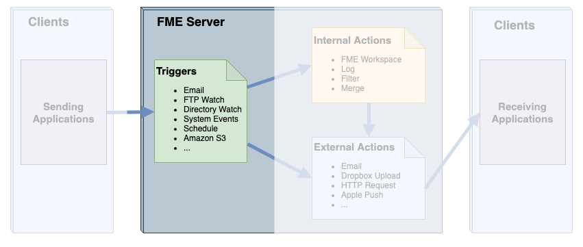
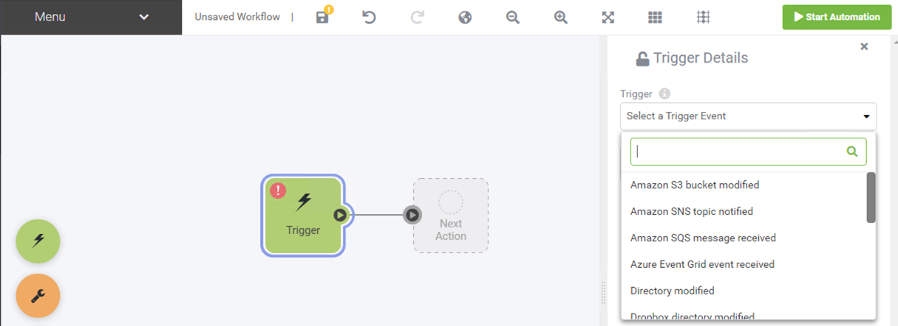

## Trigger ##

A trigger is an FME Server component that receives incoming notifications from a client.

To set up a trigger in FME Server, a workspace author (or administrator) must build a new Automation. An Automation is created in the FME Server Web Interface on the Automations > Build Automation page:

 

---

## Action ##

An action is an FME Server component that sends outgoing notifications to a client.

To send a notification in FME Server, a workspace author (or administrator) must first create an Automation that contains a trigger, the outport of this node is then connected to the action - just like how you connect transformers in FME Workbench.

Comparable to the FME Workbench canvas, Automations are constructed in a user friendly drag and drop interface. Triggers and actions are displayed on the canvas as nodes identifiable by their different color. Input and output ports are used to create connections that will pass  messages from the trigger to the associated action. The user must configure a series of parameters for the Automation to succeed dependent on the protocol.

---
