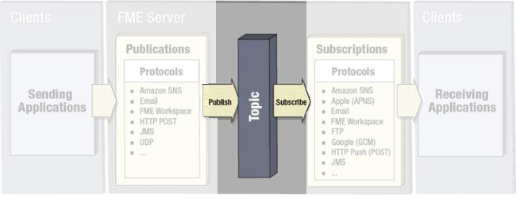

## Topics ##

A Topic is a component that acts as a mediator for messages and defines the message content. Think of it as a mix of subject line for notifications and a trigger for them to occur.

Like Publications, a Topic is created in the FME Server Web User Interface, under the Notifications section:

FME automatically creates some topics on installation, to trigger the subscriptions that it creates.

---

### Publications and Topics ###

All Publications are linked to a Topic so that when an incoming message is received it is categorized and the related Topic is triggered.

A Publication can be linked to multiple Topics, each incoming message can trigger multiple actions to occur. Additionally, multiple Publications can trigger the same topic.

For example, a lightning strike sensor might publish to the topics WeatherEvent and AircraftAlerts, whereas a flood sensor might publish to the topics WeatherEvent and RoadConditions.

---

<table style="border-spacing: 0px">
<tr>
<td style="vertical-align:middle;background-color:darkorange;border: 2px solid darkorange">
<i class="fa fa-quote-left fa-lg fa-pull-left fa-fw" style="color:white;padding-right: 12px;vertical-align:text-top"></i>
Daily Interop Reporter, Chad Pugh-Litzer says…
</td>
</tr>

<tr>
<td style="border: 1px solid darkorange">

When I write a news article I publish the article to the Daily Interop web site, tagged with a number of topics to describe it. For example, a report about a soccer team’s tax return would be filed under both ‘Financial’ and ‘Sports’ because it relates to both.

</td>
</tr>
</table>

---

### Subscriptions and Topics ###

All Subscriptions are also linked to a Topic. When a topic is triggered an outgoing message is sent. 

A subscription can be linked to multiple Topics, each topic being triggered causes an outgoing notification. Each Topic can also be subscribed to by multiple Subscriptions.

For example, a police headquarters might subscribe to the RoadConditions topic, to receive notifications on that subject. The local TV weather channel also subscribes to the RoadConditions topics, but in addition subscribes to WeatherEvent to hear about those particular events.

---

<table style="border-spacing: 0px">
<tr>
<td style="vertical-align:middle;background-color:darkorange;border: 2px solid darkorange">
<i class="fa fa-quote-left fa-lg fa-pull-left fa-fw" style="color:white;padding-right: 12px;vertical-align:text-top"></i>
InteropGeek68 says…
</td>
</tr>

<tr>
<td style="border: 1px solid darkorange">

I subscribe to articles published on the Daily Interop web site according to their topic. For example, I subscribe to reports with the topic financial, whereas my friend – InteropJock72 – subscribes to sports articles. Because Chad's article has both tags, we'd both receive it. 

</td>
</tr>
</table>

---

<!--Person X Says Section-->

<table style="border-spacing: 0px">
<tr>
<td style="vertical-align:middle;background-color:darkorange;border: 2px solid darkorange">
<i class="fa fa-quote-left fa-lg fa-pull-left fa-fw" style="color:white;padding-right: 12px;vertical-align:text-top"></i>
Miss Vector says...
</td>
</tr>

<tr>
<td style="border: 1px solid darkorange">

Please don't get this wrong! Publications and Topics have what relationship?
  1. One:One (Each Publication has one Topic, each Topic belongs to one Publication)
 2. One:Many (Each Publication can have many Topics, each Topic belongs to one Publication)
 3. Many:One (Each Publication has one Topic, each Topic can belong to multiple Publications) 
 4. Many:Many (Each Publication can have many Topics, each Topic can belong to multiple Publications)

</td>
</tr>
</table>