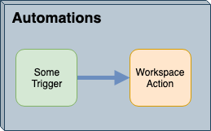

# Workspaces as Actions #

In Automations Run Workspace is labelled an action since it reacts to an incoming message and therefore must be set up by being connected to a Trigger.

Within an Automation the Action protocol is called (as you might have guessed) *Run a Workspace* and falls under the Internal Action Category (orange node).

After selecting Run Workspace as the Action type, the user must first specify a Repository and workspace, the selected workspace is then examined and a list of its published parameters provided:

Having the parameters in a dialog like this means it is simple and easy to set up a workspace to run however you want it to in response to a trigger. Once created, whenever that Trigger receives a message from the sending client, the action will react by submitting that workspace to run on FME Server.

---

<table style="border-spacing: 0px">
<tr>
<td style="vertical-align:middle;background-color:darkorange;border: 2px solid darkorange">
<i class="fa fa-bolt fa-lg fa-pull-left fa-fw" style="color:white;padding-right: 12px;vertical-align:text-top"></i>
NEW
</td>
</tr>

<tr>
<td style="border: 1px solid darkorange">

In FME 2020.0, you can now choose the <a href="https://docs.safe.com/fme/html/FME_Server_Documentation/WebUI/Automations-Actions/Action-Run-Dynamic-Workspace.htm">Run a Dynamic Workspace</a> action when building Automations. This action lets you run a workspace determined by the Output Keys of a previous Trigger or Action in your Automation. This lets you dynamically run workspaces in response to events earlier in the Automation. For example, you might run one workspace that reads in some data and determines which workspace to run, and then outputs a key with the workspace Repository and name. The Run a Dynamic Workspace action can then be used to run the correct workspace.

</td>
</tr>
</table>
