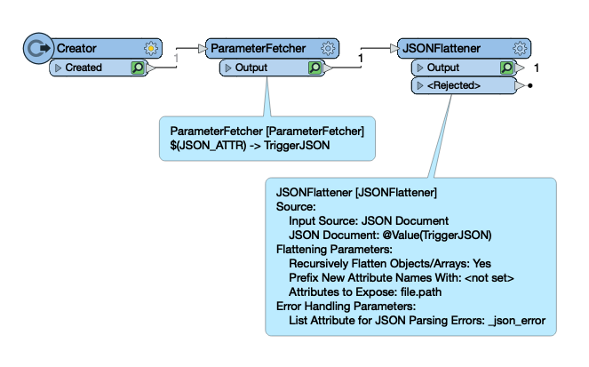

## Message Content ##

The ability to interpret and process message content is a key reason for using FME workspaces as actions. They can receive a message and then transform it in whatever way is required.

---

### Passing Messages ###

A trigger passes messages to the workspace action. When it does, the message is written into a temporary JSON file. For the majority of protocols, the JSON elements are known and flattened within the Automations window so it is easy to retrieve the information downstream in the Automation without digesting the entire JSON event. However, under certain scenarios, you may wish to pass the entire event as JSON into a workspace.

The webhook protocol is a good example of this. Webhooks have a post URL which means they can be set up to receive messages from a third party application. In this instance, the JSON may contain multiple layers with attribute names not recognized by FME Server.

In order to retrieve this body, the full message can be passed into the Workspace for processing through a published parameter.

---

### Interpreting the Message ###

An incoming message can be scanned and processed with a number of different transformers. If the messages are in JSON format there are transformers such as the JSONExtractor and JSONFlattener. Similarly there are XMLFlattener and XMLFragmenter transformers for XML content.

These transformers will convert the message from a JSON (or XML) string and into attributes that FME Workbench is able to process.

Here - for example - an author kickstarts the workspace using a Creator, and then has a ParameterFetcher to bring in the JSON message and finally a JSONFlattener to query and expose the attributes in the Topic message:

If the incoming message was a directory watch, then the JSON content may look like this:

<pre>
{
  "file.path":"/data/fmeserverdata/resources/data/Example.txt",
  "file.event":"CREATE",
  "source":"dirwatch",
  "time":"2019-05-06T18:21:22Z",
  "event.id":"f754c6b3-c75c-4e95-a49e-0a1db41decfc
}
</pre>

Notice how as well as including the updated file path it includes other information about the Automation event.

When converted into FME attributes using the JSONFlattener transformer the result – as shown in Visual Preview – will look something like this:

Now the content is available to the workspace as a set of attributes and can be processed as required.

---

### Using the Message ###

What you do with the message depends on your required setup. If the topic is merely a trigger, and the message is unimportant, it could be ignored. However, in most cases, the message content *is* important.

For the most part, Automations should do the work for you, however there are almost limitless ways FME could be used to process an incoming message if necessary. One useful example to consider is where the message contains an X/Y coordinate - for example the location of a person. Here, the X/Y coordinate could be converted into a point feature with the VertexCreator transformer, and from there, any number of FME transformers could be used to carry out spatial processing such as a geofence.

This process is important when the Topic message contains contents that is not standard to the Trigger and needs to be processed within a workflow to get access to it.
