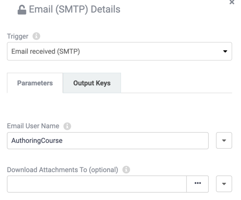

## SMTP Trigger ##

SMTP Triggers are used when data is sent to FME Server via a direct email. FME Server receives an email and triggers an Action in response.

Such triggers are possible because FME Server includes a built-in email server as one of its components. However, this does require that the hostname and domain of your FME Server should resolve to a publicly accessible IP or DNS.

---

<table style="border-spacing: 0px">
<tr>
<td style="vertical-align:middle;background-color:darkorange;border: 2px solid darkorange">
<i class="fa fa-quote-left fa-lg fa-pull-left fa-fw" style="color:white;padding-right: 12px;vertical-align:text-top"></i>
FME Lizard says …
</td>
</tr>

<tr>
<td style="border: 1px solid darkorange">

The steps to set up the built-in email server for notifications are documented in the FME Server Reference Manual.
  However, FME Cloud instances are automatically configured for email notifications, and have a public domain name too, so you don’t need to do any additional setup.

</td>
</tr>
</table>

---

### Creating an SMTP Trigger ##

Creating an SMTP Trigger is done in the Automations: Build Automation section of the FME Server web interface, by choosing the Email (SMTP) protocol as a new Trigger.

Once the protocol type is selected there, is only one parameter that must be configured, that is the Email User Name. This does not need to be an existing user or email; in the above example, it is set up to be AuthoringCourse. Note that you do not need to specify *@FMEServer-Hostname.com* in the Email User Name parameter.

To construct the full email address, combine the Email Username with your FMEServer hostname. Now, for this example,  whenever an email is sent to AuthoringCourse@*YourFMEServerHostname* this Automation will receive an incoming message that contains the entire contents of that email, including the from and to address, and any attachments. This information is all processed by FME Server so it can be used to trigger an Action downstream in the workspace.

In the SMTP trigger, there is an Optional Parameter to specify the location to download any email attachments to. If this is not defined, the attachments will still be saved to a temporary location on FME Server.
