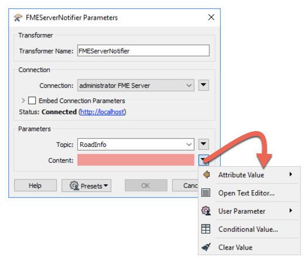
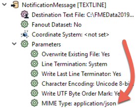

## Workspace Outgoing Message Content ##

If you are choosing the route to have a Workspace trigger a Topic, rather than going straight to an external action, it can include a message.

The ability to construct message content from a variety of sources – including spatial – is a key reason for using FME workspaces as a trigger. Workspaces can transform data in multiple ways, use it to construct a message, and then dispatch that message to users as a notification.

When the FMEServerNotifier transformer triggers a topic, the message can be defined by an attribute, constructed in a text editor, obtained from a user parameter, or even set up as a conditional value:

When a topic is triggered by registering the workspace with a service topic, the message is sent via a writer:

Here the message is being passed through a Text File writer.

---

### Content Format ###

For the purposes of FME notifications, the content of a workspace message can be in any format, even a plain text message. However, for the benefit of a web-based subscriber, the outgoing message is often in a JSON or XML format.

For example, here a workspace constructs a plain-text weather (lightning) alert using an AttributeCreator. The message attribute is connected to a Text File Writer in order to provide a means for publishing the outgoing message:

Importantly, the Text File Writer has a MIME type setting that can be applied:

So even if the message were JSON or XML, standard practice is to use a text writer.

---

<!--Person X Says Section-->

<table style="border-spacing: 0px">
<tr>
<td style="vertical-align:middle;background-color:darkorange;border: 2px solid darkorange">
<i class="fa fa-quote-left fa-lg fa-pull-left fa-fw" style="color:white;padding-right: 12px;vertical-align:text-top"></i>
FME Lizard says...
</td>
</tr>

<tr>
<td style="border: 1px solid darkorange">

A Text File writer is the most common method of supplying messages, regardless of format. Even if the message is constructed as a snippet of JSON or XML, it would still be passed through the Text File writer.

</td>
</tr>
</table>
