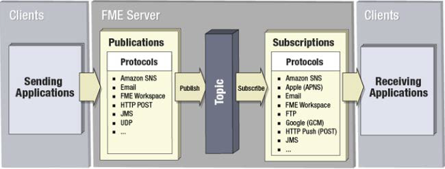

## The Notification Service ##

Prior to FME Server 2019 incoming and outgoing message handling was built using the Notification Service. Although the overall concept is the same the way you put together these notifications was more challenginge and the service was made up of three main components spread across multiple pages in the FME Server Web UI:

- **Publications:** Event handlers that listen for incoming notifications
- **Subscriptions:** Event handlers that dispatch outgoing notifications
- **Topics:** Subjects that describe what a notification is about

In Automations Triggers are equivalent to Publications and both External and Internal Actions are grouped as one under Subscriptions. In the Notification Service all messages had to pass through a Topic, this is no longer required however Topics are still available for use.

Whether you are new to FME Server or just running through this training course as a refresher moving forward we recommend using Automations to build any real-time workflows. If you would like more information on the Notification Service please refer to the 2018 Server Authoring Course which will run through the same series of exercises we have just completed in the Notification Service.
