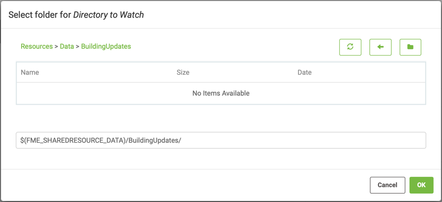
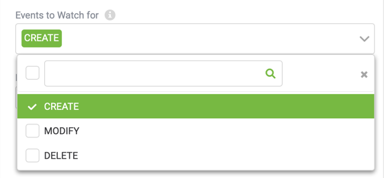
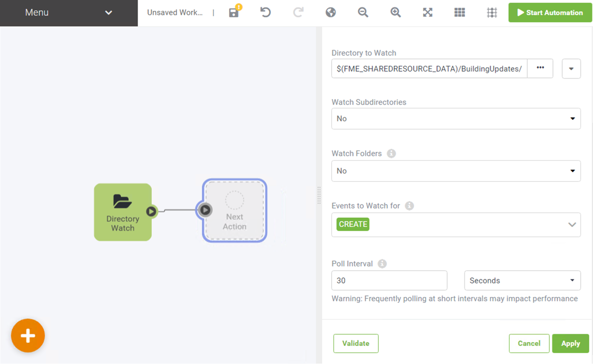
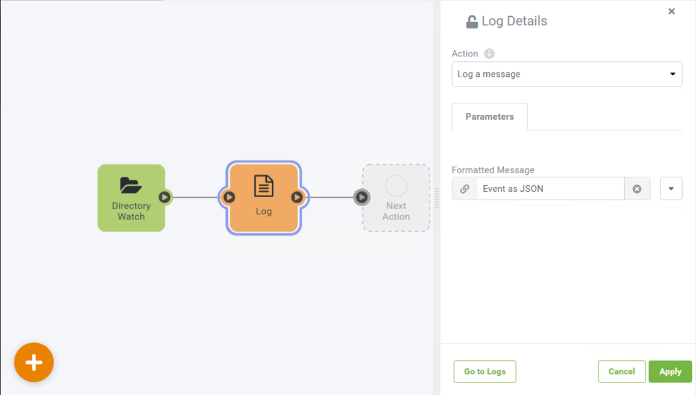
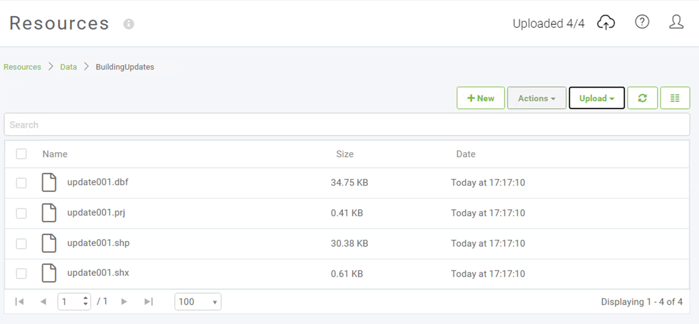
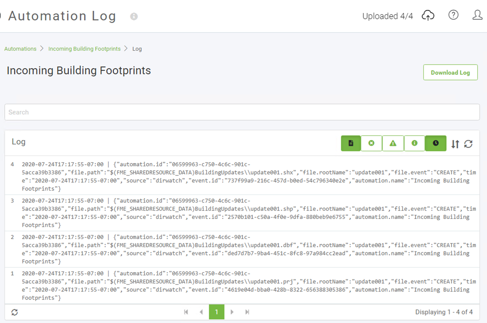

<!--Instructor Notes-->

<!--Exercise Section-->

<table style="border-spacing: 0px;border-collapse: collapse;font-family:serif">
<tr>
<td width=25% style="vertical-align:middle;background-color:darkorange;border: 2px solid darkorange">
<i class="fa fa-cogs fa-lg fa-pull-left fa-fw" style="color:white;padding-right: 12px;vertical-align:text-top"></i>
Exercise 4.1
</td>
<td style="border: 2px solid darkorange;background-color:darkorange;color:white">
Building Updates Automation
</td>
</tr>

<tr>
<td style="border: 1px solid darkorange; font-weight: bold">Data</td>
<td style="border: 1px solid darkorange">Building footprints (Esri Shapefile)</td>
</tr>

<tr>
<td style="border: 1px solid darkorange; font-weight: bold">Overall Goal</td>
<td style="border: 1px solid darkorange">Trigger notification for new files</td>
</tr>

<tr>
<td style="border: 1px solid darkorange; font-weight: bold">Demonstrates</td>
<td style="border: 1px solid darkorange">Directory Watch Trigger</td>
</tr>

<tr>
<td style="border: 1px solid darkorange; font-weight: bold">Start Workspace</td>
<td style="border: 1px solid darkorange">N/A</td>
</tr>

<tr>
<td style="border: 1px solid darkorange; font-weight: bold">Start Server Project</td>
<td style="border: 1px solid darkorange">N/A</td>
</tr>

<tr>
<td style="border: 1px solid darkorange; font-weight: bold">End Workspace</td>
<td style="border: 1px solid darkorange">N/A</td>
</tr>

<tr>
<td style="border: 1px solid darkorange; font-weight: bold">End Server Project</td>
<td style="border: 1px solid darkorange">C:\FMEData2020\Projects\ServerAuthoring\RealTime-Ex1-Complete.fsproject</td>
</tr>

</table>

---

As a technical analyst in the GIS department, you want to start experimenting with Automations in FME Server. The Directory Watch protocol seems like a good place to start, and you were already thinking about a shared folder where users place Shapefile datasets for adding to, or updating, the corporate database.

 **1) Create Resources Folder**
 Connect to FME Server (admin/FMElearnings). The first step is to create a Resources folder to upload the data. Open the FME Server web interface and navigate to the Files & Connections > Resources page.

Browse to the Data folder and create a new subfolder called BuildingUpdates:

---

<!--Person X Says Section-->

<table style="border-spacing: 0px">
<tr>
<td style="vertical-align:middle;background-color:darkorange;border: 2px solid darkorange">
<i class="fa fa-quote-left fa-lg fa-pull-left fa-fw" style="color:white;padding-right: 12px;vertical-align:text-top"></i>
FME Lizard says...
</td>
</tr>

<tr>
<td style="border: 1px solid darkorange">

This exercise utilizes the FME Server Resource folders, but you could also watch a Directory outside of FME Server Resources by creating a Resource Connection or reference a shared UNC path.
 There is also native support in FME Server to watch for new resources in Amazon S3 Buckets, Dropbox, and FTP. Using the same concepts described here, you could use one of these protocols instead of Directory Watch.
</td>
</tr>
</table>

---

 **2) Create Automation**
 Now to create the Automation that will watch the BuildingUpdates Directory for incoming files. Navigate to Automations: Build Automation on the side menu bar. In the Getting Started dialog that appears when you go to the Automations page for the first time, click on the Build tab and click Create New to start a new Automation.

By default, Automations starts in guided mode. This means that there is already a Trigger node on the canvas but it will still need to be configured.

Start by double-clicking the Trigger and a parameter box will appear on the right hand side of the canvas.
Select Directory modified from the drop-down list as the Trigger for this Automation.

 **3) Define Trigger Parameters**
 After selecting a Trigger type a list of configurable parameters appears in the dialog. Click the ellipsis button to browse the FME Server Resources and set the Directory to Watch parameter. Select the newly created BuildingUpdates folder under the Data subfolder:

Leave the Watch Subdirectories and Watch Folders parameters set to No, since we are only interested in monitoring for files in the BuildingUpdates folder directly.

Then for the Events to Watch for parameter remove the MODIFY and DELETE actions. Since we are looking to add to the corporate database, in this example we are only interested in monitoring for new files arriving, not old ones being changed or removed:

Lastly, change the Poll Interval to 30 Seconds and then in the bottom left corner, click on the Validate button to ensure the trigger was set up correctly. Now click Apply to save these parameters. In the canvas the Trigger node will update to show it is a Directory Watch.

Save the Automation by selecting Menu > Save As and name the Automation "Incoming Building Footprints".

 **4) Log Message**
 Before we start the Automation, we need to add an Action so the Trigger protocol can parse the notifications onwards. Before processing the data we first want to check the Directory Watch trigger is working as expected. To do this we can send the incoming messages to a log file located on FME Server.

Select the Next Action node and set the Action to Log a message.

Click on the drop-down arrow for the Message parameter and select Event > Event as JSON because in this instance we want to record the entire incoming message from the Directory Watch protocol.

---
<!--Tip Section-->

<table style="border-spacing: 0px">
<tr>
<td style="vertical-align:middle;background-color:darkorange;border: 2px solid darkorange">
<i class="fa fa-info-circle fa-lg fa-pull-left fa-fw" style="color:white;padding-right: 12px;vertical-align:text-top"></i>
TIP
</td>
</tr>

<tr>
<td style="border: 1px solid darkorange">

A trigger stores the incoming message event details as JSON however for the standard protocols FME is able to flatten the JSON down into its separate elements so the workspace or other subsequent action does not need to be able to handle this.
 If your trigger contains information from a webhook that is buried in the JSON you can parse the entire message into a parameter to flatten using JSON transformers in FME Workbench.

</td>
</tr>
</table>

---

 Click Apply to save this Log configuration.

 **5) Start Automation**
 In order for FME Server to start watching the directory for incoming files, the Automation must be enabled. Select the Start Automation button in the top right corner. The button will turn red and an orange warning ribbon will appear across the canvas indicating that your Automation is currently running. This means FME Server is now checking that directory every 30 seconds for updates.

---

<!--Person X Says Section-->

<table style="border-spacing: 0px">
<tr>
<td style="vertical-align:middle;background-color:darkorange;border: 2px solid darkorange">
<i class="fa fa-quote-left fa-lg fa-pull-left fa-fw" style="color:white;padding-right: 12px;vertical-align:text-top"></i>
FME Lizard says...
</td>
</tr>

<tr>
<td style="border: 1px solid darkorange">

As your Automation grows you may wish to turn off Guided mode, this can be done by selecting Hide Guides from the Menu drop-down list.

</td>
</tr>
</table>

---

 **6) Test Automation**
 Now let's test the Automation. Locate the source Shapefile datasets in C:\FMEData2020\Data\Engineering\BuildingFootprints. Select a set of files (.dbf, .prj, .shp, .shx) and upload these files into the newly created Resources folder. There are two ways to do this.

You can use the file system (by copying the files to C:\ProgramData\Safe Software\FME Server\resources\data\BuildingUpdates) or use the FME Server web interface.

Check for updates in the log by selecting Menu > View Log File from the Incoming Building Footprints Automation.

If the log is not yet present, select the refresh button until it appears. You will see four CREATE messages from the Logger showing the individual file paths.

When you view this log file you might also notice reports of the Automation sending Jobs to FME Engine. This is because FME Server is actually performing the Log action using a simple FME Workspace.

---

<!--Person X Says Section-->

<table style="border-spacing: 0px">
<tr>
<td style="vertical-align:middle;background-color:darkorange;border: 2px solid darkorange">
<i class="fa fa-quote-left fa-lg fa-pull-left fa-fw" style="color:white;padding-right: 12px;vertical-align:text-top"></i>
FME Lizard says...
</td>
</tr>

<tr>
<td style="border: 1px solid darkorange">

Remember, the Poll interval is set up to check the folder only once per 30 seconds - so if the Log file doesn't immediately appear, don't panic! Be patient and it will appear shortly.
</td>
</tr>
</table>

---

Now we know how the Directory Watch Trigger works! We will see in subsequent exercises how to process this information.

---

<!--Exercise Congratulations Section-->

<table style="border-spacing: 0px">
<tr>
<td style="vertical-align:middle;background-color:darkorange;border: 2px solid darkorange">
<i class="fa fa-thumbs-o-up fa-lg fa-pull-left fa-fw" style="color:white;padding-right: 12px;vertical-align:text-top"></i>
CONGRATULATIONS
</td>
</tr>

<tr>
<td style="border: 1px solid darkorange">

By completing this exercise you have learned how to:
 
<ul><li>Create a new Automation</li>
<li>Use Directory Watch to poll an FME Server Resource</li>
<li>Test a Directory Watch trigger by reading a log</li></ul>

</td>
</tr>
</table>
