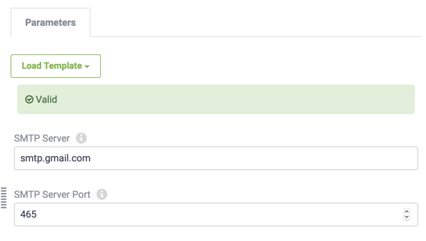

<!--Instructor Notes-->

<!--Exercise Section-->

<table style="border-spacing: 0px;border-collapse: collapse;font-family:serif">
<tr>
<td width=25% style="vertical-align:middle;background-color:darkorange;border: 2px solid darkorange">
<i class="fa fa-cogs fa-lg fa-pull-left fa-fw" style="color:white;padding-right: 12px;vertical-align:text-top"></i>
Exercise 4.4
</td>
<td style="border: 2px solid darkorange;background-color:darkorange;color:white">
Building Updates Notification System
</td>
</tr>

<tr>
<td style="border: 1px solid darkorange; font-weight: bold">Data</td>
<td style="border: 1px solid darkorange">Building footprints (Esri Shapefile)</td>
</tr>

<tr>
<td style="border: 1px solid darkorange; font-weight: bold">Overall Goal</td>
<td style="border: 1px solid darkorange">Provide email-driven notifications for updates</td>
</tr>

<tr>
<td style="border: 1px solid darkorange; font-weight: bold">Demonstrates</td>
<td style="border: 1px solid darkorange">Email Actions</td>
</tr>

<tr>
<td style="border: 1px solid darkorange; font-weight: bold">Start Workspace</td>
<td style="border: 1px solid darkorange">N/A</td>
</tr>

<tr>
<td style="border: 1px solid darkorange; font-weight: bold">End Workspace</td>
<td style="border: 1px solid darkorange">N/A</td>
</tr>

</table>

---

After configuring an Automation in FME Server to process building footprint updates with both the Directory Watch and Email Triggers, your supervisor is wondering if they can receive an email whenever the corporate database is updated.

Using an external email server, you think that it is possible to configure the existing Automation in FME Server to satisfy this requirement.

---

<!--Person X Says Section-->

<table style="border-spacing: 0px">
<tr>
<td style="vertical-align:middle;background-color:darkorange;border: 2px solid darkorange">
<i class="fa fa-quote-left fa-lg fa-pull-left fa-fw" style="color:white;padding-right: 12px;vertical-align:text-top"></i>
Miss Vector says...
</td>
</tr>

<tr>
<td style="border: 1px solid darkorange">

This exercise continues where Exercise 3 left off. You must have completed Exercise 3 to carry out this exercise.
 Access to an SMTP Email Server is required for sending email in this exercise. Gmail, Outlook, and Yahoo! are examples of acceptable web-based solutions if you do not have access to an internal email server.
</td>
</tr>
</table>

---

 **1) Add External Action**
 Open the FME Server web interface and navigate to the Automations:Manage page. Click the Incoming Building Footprints and stop the Automation to allow for editing. The final step in the Automation is to an External Action that is an email service through which a response will be sent.

Select the plus icon in the bottom left and this time drag a blue icon onto the canvas. Connect this to the Success (check mark) output port of the Run Workspace node, which in this instance is now also acting as a Trigger.

Double click on the node to configure it, set the action to send an email and set up your SMTP email server parameters.

In case it is of use, the server information for Gmail is as follows:

<table style="border: 0px">

<tr>
<td style="font-weight: bold">SMTP Server Host</td>
<td style="">smtp.gmail.com</td>
</tr>

<tr>
<td style="font-weight: bold">Server Port</td>
<td style="">465</td>
</tr>

<tr>
<td style="font-weight: bold">Connection Security</td>
<td style="">SSL/TLS</td>
</tr>

</table>

There is also the option to load a template for some other Email Servers, if you are unsure what port/host they use.  Regardless of the email provider, you should set these parameters as follows:

<table style="border: 0px">
<tr>
<td style="font-weight: bold">Email To</td>
<td style="">(An email you have access to check)</td>
</tr>

<tr>
<td style="font-weight: bold">Email From</td>
<td style="">Your account name (for example fmeshapeprocessing@gmail.com)</td>
</tr>

<tr>
<td style="font-weight: bold">Email Subject</td>
<td style="">Building Footprints Database Updated</td>
</tr>

<tr>
<td style="font-weight: bold">Email Body</td>
<td style="">The Building Footprints database has been updated!</td>
</tr>

</table>

---

<!--Person X Says Section-->

<table style="border-spacing: 0px">
<tr>
<td style="vertical-align:middle;background-color:darkorange;border: 2px solid darkorange">
<i class="fa fa-quote-left fa-lg fa-pull-left fa-fw" style="color:white;padding-right: 12px;vertical-align:text-top"></i>
Miss Vector says...
</td>
</tr>

<tr>
<td style="border: 1px solid darkorange">

For the Email Body parameter click the drop-down arrow and then select Text Editor. This will open a pop-up window that allows you to write email content that also contains information from elements in the Automation. This might be useful for sending out Notifications to an Administrator on Job failure, where you can include the Job ID and Job Status Message in the email body, and the Email Attachment parameter to the Job log.
</td>
</tr>
</table>

---
Before you Apply these parameter settings validate the Email Server configuration using the Validate button, if FME Server is unable to connect to the email server you can troubleshoot this before finding out after your automation is running.

---
<!--Warning Section-->

<table style="border-spacing: 0px">
<tr>
<td style="vertical-align:middle;background-color:darkorange;border: 2px solid darkorange">
<i class="fa fa-exclamation-triangle fa-lg fa-pull-left fa-fw" style="color:white;padding-right: 12px;vertical-align:text-top"></i>
NOTE
</td>
</tr>

<tr>
<td style="border: 1px solid darkorange">

Depending on your Gmail security settings, you may need to create an app-specific password to allow FME Server to log into the account. See this article if you are noticing errors connecting to your account: <a href="https://knowledge.safe.com/articles/394/imap-publisher-not-reading-emails-from-gmail.html">IMAP Publication or Email Subscription is not Reading Emails from Gmail</a>

</td>
</tr>
</table>

---

 **2) Test Automation**
 Test the Automation by either sending an email with a zip file attachment of the Shapefile datasets (.dbf, .prj, .shp, .shx) from C:\FMEData2019\Data\Engineering\BuildingFootprints, or by adding this collection of files to the Directory Watch as in Exercise 1.

If the workflow was successful, you should receive an email back with a response!

---

<!--Exercise Congratulations Section-->

<table style="border-spacing: 0px">
<tr>
<td style="vertical-align:middle;background-color:darkorange;border: 2px solid darkorange">
<i class="fa fa-thumbs-o-up fa-lg fa-pull-left fa-fw" style="color:white;padding-right: 12px;vertical-align:text-top"></i>
CONGRATULATIONS
</td>
</tr>

<tr>
<td style="border: 1px solid darkorange">

By completing this exercise you have learned how to:
 
<ul><li>Set up an outgoing Email Action</li>
<li>Trigger an Email notification through Automations</li></ul>

</td>
</tr>
</table>
