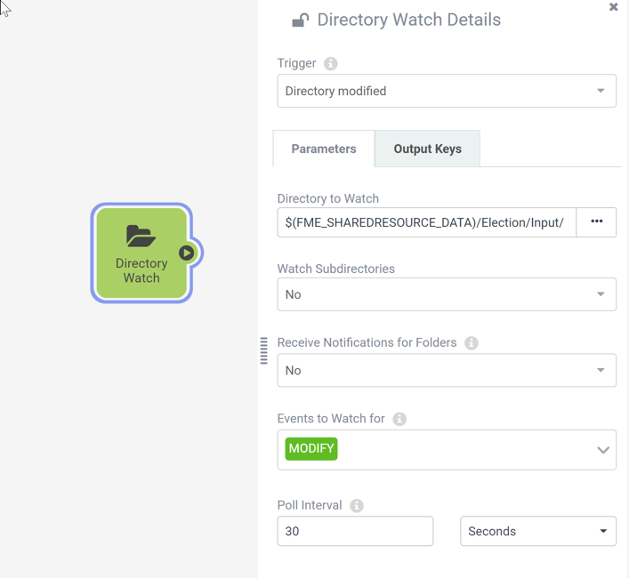
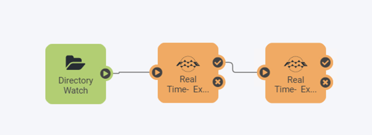

<!--Instructor Notes-->

<!--Exercise Section-->

<table style="border-spacing: 0px;border-collapse: collapse;font-family:serif">
<tr>
<td width=25% style="vertical-align:middle;background-color:darkorange;border: 2px solid darkorange">
<i class="fa fa-cogs fa-lg fa-pull-left fa-fw" style="color:white;padding-right: 12px;vertical-align:text-top"></i>
Exercise 4.5
</td>
<td style="border: 2px solid darkorange;background-color:darkorange;color:white">
Authoring Workspace Chains in Automations
</td>
</tr>

<tr>
<td style="border: 1px solid darkorange; font-weight: bold">Data</td>
<td style="border: 1px solid darkorange">Voting Divisions (GML (Geography Markup Language)) Addresses (Esri Geodatabase (File Geodb API))</td>
</tr>

<tr>
<td style="border: 1px solid darkorange; font-weight: bold">Overall Goal</td>
<td style="border: 1px solid darkorange">Create an Automation to chain two translations together</td>
</tr>

<tr>
<td style="border: 1px solid darkorange; font-weight: bold">Demonstrates</td>
<td style="border: 1px solid darkorange">Authoring workspace chains using Automations</td>
</tr>

<tr>
<td style="border: 1px solid darkorange; font-weight: bold">Start Project</td>
<td style="border: 1px solid darkorange">C:\FMEData2020\Projects\ServerAuthoring\RealTime-Ex5-Begin.fsproject
</td>
</tr>

<tr>
<td style="border: 1px solid darkorange; font-weight: bold">End Project</td>
<td style="border: 1px solid darkorange">C:\FMEData2020\Projects\ServerAuthoring\RealTime-Ex5-Complete.fsproject</td>
</tr>

</table>

---

You're a technical analyst in the GIS department of your local city. You have plenty of experience using FME Desktop, and your department has recently begun using FME Server.

A municipal election is about to happen, and Elections Interopolis have provided a dataset of new voting divisions in GML format. You've already created a workspace to translate these voting divisions to a SpatiaLite database format for use within the city and that data is being written to a resources folder on FME Server so everyone can use it.

Coincidentally, the planning department heard of this update. They have a workspace that assigns voting division IDs to each of the records in the city's address database for use in election planning and would like to have their workspace run automatically whenever there are any updates to the voting divisions.

You realize that you can chain these two translations together to be carried out consecutively and automatically whenever the Election Voting GML file is updated using an Automation.

---

 **1) Import Project**
 In the FME Server web interface, go to Projects > Manage Projects and import the Start Project for this Exercise from C:\FMEData2020\Projects\ServerAuthoring\RealTime-Ex5-Begin.fsproject

This will contain the two workspaces we want to run in sequence as well as input and output Resource folders for this workflow. Take a moment to familiarize yourself with the contents of this project and look at the two included workspaces using the View Workspace page.

 **2) Create Automation**
 In the FME Server interface, navigate to the Automations > Build page to start building a new Automation.

Save the Automation first and give it a name such as JobChaining.

 **3) Add Trigger**
 You want these jobs to start running whenever new data is added to the Election/Input folder, so set up a Trigger to handle that.

Click on the Trigger that is already placed in your Automation to configure it. Set the Trigger as follows:

<table style="border: 0px">

<tr>
<th style="font-weight: bold">Parameter</th>
<th style="">Value</th>
</tr>

<tr>
<td style="font-weight: bold">Trigger</td>
<td style="">Directory Modified</td>
</tr>

<tr>
<td style="font-weight: bold">Directory to Watch</td>
<td style="">Data > Election > Input</td>
</tr>

<tr>
<td style="font-weight: bold">Events to Watch for</td>
<td style="">MODIFY</td>
</tr>

<tr>
<td style="font-weight: bold">Poll Interval</td>
<td style="">30 Seconds</td>
</tr>

</table>

<!--Warning Section-->

<table style="border-spacing: 0px">
<tr>
<td style="vertical-align:middle;background-color:darkorange;border: 2px solid darkorange">
<i class="fa fa-exclamation-triangle fa-lg fa-pull-left fa-fw" style="color:white;padding-right: 12px;vertical-align:text-top"></i>
WARNING
</td>
</tr>

<tr>
<td style="border: 1px solid darkorange">

We're setting the Poll Interval here to 30 seconds just to make testing faster for the purposes of training. For regular use, we'd recommend using minutes as the minimum interval.
 If you end up with many Automations all set to poll every few seconds, it could take a toll on system performance.

</td>
</tr>
</table>

 **4) Add Workspace Action**
 Now we want to add an Action to run the first of the two workspaces we want to run in our job chain.

Click on the + button and drag an Action onto the canvas. Connect it to the Directory Watch Trigger and configure it as follows:

<table style="border: 0px">

<tr>
<td style="font-weight: bold">Action</td>
<td style="">Run Workspace</td>
</tr>

<tr>
<td style="font-weight: bold">Repository</td>
<td style="">Training</td>
</tr>

<tr>
<td style="font-weight: bold">Workspace</td>
<td style="">RealTime-Ex5-WorkspaceA.fmw</td>
</tr>

</table>

 **5) Add Second Workspace Action**
 Note that a Workspace Action will always wait until the job has completed before moving onto the next Action within the Automation.

To set up the second workspace to run, simply add a second Action and connect it to the checkmark (or Action Succeeded) port on the Workspace Action we just added. Configure this one to run the RealTime-Ex5-WorkspaceB.fmw from inside the Training repository.

Your final Automation should look like this:

 **6) Save and Start Automation**
 Save your Automation. Then click the Start Automation button to start the Automation.

 **7) Test the Automation**
  Now you can the Automation by uploading a modified version of the ElectionVoting.gml file to Resources.

Open the Resources page and navigate to Data > Election > Input. Click on Upload > Files and select the following file to upload:

`C:\FMEData2020\Resources\ServerAuthoring\JobChaining\ElectionVoting.gml`

Wait a minute or so and then View Triggered Jobs for your Automation, you should see that both chained workspaces successfully ran in order.

<!--Exercise Congratulations Section-->

<table style="border-spacing: 0px">
<tr>
<td style="vertical-align:middle;background-color:darkorange;border: 2px solid darkorange">
<i class="fa fa-thumbs-o-up fa-lg fa-pull-left fa-fw" style="color:white;padding-right: 12px;vertical-align:text-top"></i>
CONGRATULATIONS
</td>
</tr>

<tr>
<td style="border: 1px solid darkorange">

By completing this exercise you have learned how to:
 
<ul><li>Create a Job Chain within an FME Server Automation to run jobs in sequence</li>
</ul>

</td>
</tr>
</table>
