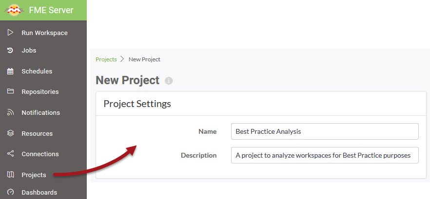
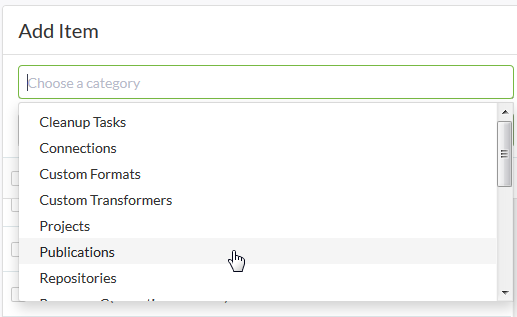
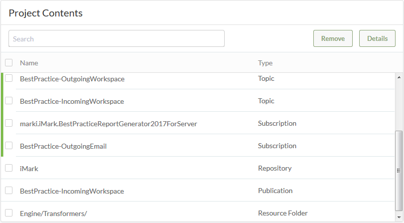
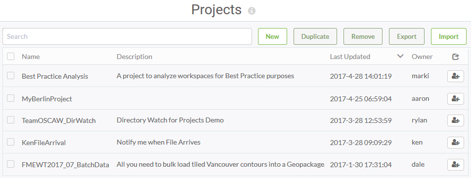

# Creating a Project

Creating a project involves initiating the creation process and then simply adding the required components to that project.

## Create Project ##

Creating a project is carried out on the Projects page (accessed via the main menu) by clicking the New button and entering some basic project settings such as Name and Description:

Below the Project Settings parameters are two dialogs:

<!--Updated Section--> 

<table style="border-spacing: 0px">
<tr>
<td style="vertical-align:middle;background-color:darkorange;border: 2px solid darkorange">
<i class="fa fa-bolt fa-lg fa-pull-left fa-fw" style="color:white;padding-right: 12px;vertical-align:text-top"></i>
.1 UPDATE
</td>
</tr>

<tr>
<td style="border: 1px solid darkorange">

For FME Server 2017.1 and newer, the "Add Item" dialog is not visibile until the user selects the "Add" button (located in the same space).

</td>
</tr>
</table>

The lower right-hand dialog allows components to be added to the project:

The lower left-hand dialog shows which components have been added to the project:

The above image shows a number of components added to an existing project. Once complete the project is added to the list on the Projects landing page:

