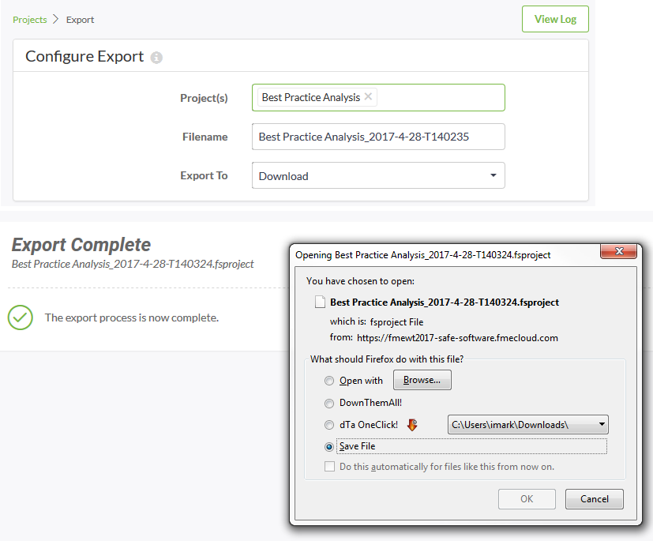

# Managing Projects

One of the key uses for a Project is in transferring a set of FME Server components from one Server instance to another. This is carried out by using the Export and Import tools. There is also a tool for Removing a Project from a system. 

## Exporting a Project ##

Exporting a project is carried out on the Projects page (accessed via the main menu) by selecting the Project to be exported and clicking the Export button:

This opens a dialog in which to configure and carry out the export:

The export writes to a file with a .fsproject extension. There is an option to either provide the export as a download, or to write it to a Resources folder.

---

<!--Person X Says Section-->

<table style="border-spacing: 0px">
<tr>
<td style="vertical-align:middle;background-color:darkorange;border: 2px solid darkorange">
<i class="fa fa-quote-left fa-lg fa-pull-left fa-fw" style="color:white;padding-right: 12px;vertical-align:text-top"></i>
Miss Vector says...
</td>
</tr>

<tr>
<td style="border: 1px solid darkorange">

If you choose to export a Project to a Resources folder (rather than download it) then what additional capability do you gain?
  1. The ability to trigger a notification topic on completion of the export.
 2. The ability to export the FME license for the server.
 3. The ability to remove all components of the project as they are exported.
 4. The ability to change ownership of the components to your own user account.

</td>
</tr>
</table>
