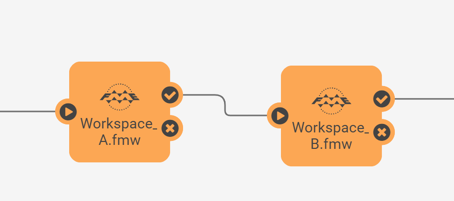
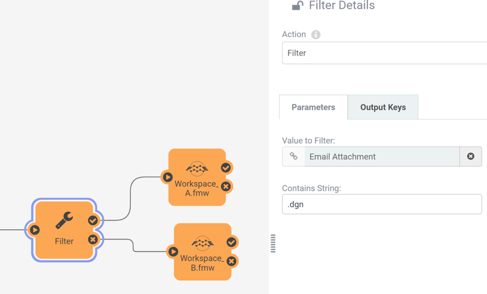
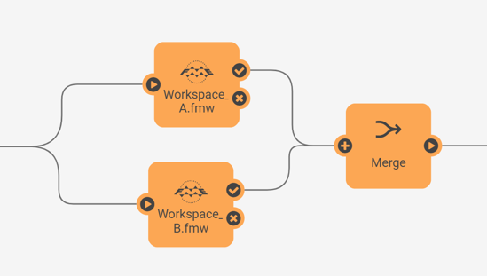

## Job Chains and Automations ##

Automations provide another option for workflow management within FME Server. Instead of needing to create a controller workspace to orchestrate the running of other workspaces, you can simply create an Automation to handle triggering jobs in a particular sequence.

Setting up a job chain within an Automation is as simple as connecting two or more Run Workspace actions to a Trigger. Depending on the desired behavior, you can connect the run workspace actions together in sequence or in parallel.

### Run Jobs in Sequence ###

When actions are connected in sequence, they are connected together one after the other in a string like this:

When connected like this, these jobs will run sequentially. So, the first job will be submitted and FME Server will wait for it to run to completion. When it finishes, the next job will run to completion before the next action in the chain starts.

In this example, since the second workspace is connected to the Success port of the action for the first workspace, it will only run if the first job completes successfully. You can add additional actions connected to the failed ports if you wanted to handle those failures in some way. For example, if you wanted to send an email out if one of the jobs in this Automation failed to complete.

### Run Jobs in Parallel ###

When actions are connected in parallel, they are connected to a single starting point (this can be a Trigger or another action within the automation) instead of in a row:

When connected like this, both these jobs will be submitted at the same time.

If there are at least two engines available on FME Server, then they will both run at the same time. If there is only one available engine, one job will run on that engine and the next job will wait in the queue until an engine becomes available. There is no guarantee as to which of these jobs will run first in this case (unless Job Queues have been configured for these workspaces to give them a priority).

### Conditional Processing ###

There are two Action types that are particularly useful if you need to build some additional logic into your Automations. These are the Filter and Merge Actions.

The Filter can be used to check if a simple condition is true or false. In the example below, we are using a Filter to check if an email contained a .dgn file as an attachment. If that is true, we will run one workspace and if it's false, we will run a different workspace.

The Merge Action can be used to merge two parallel streams together. This is useful if you want to trigger several jobs to run at the same time (in parallel), and then wait for all of them to complete before moving onto the next action:

